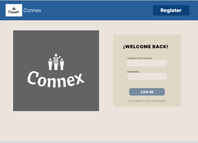
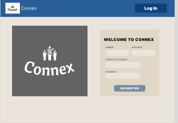
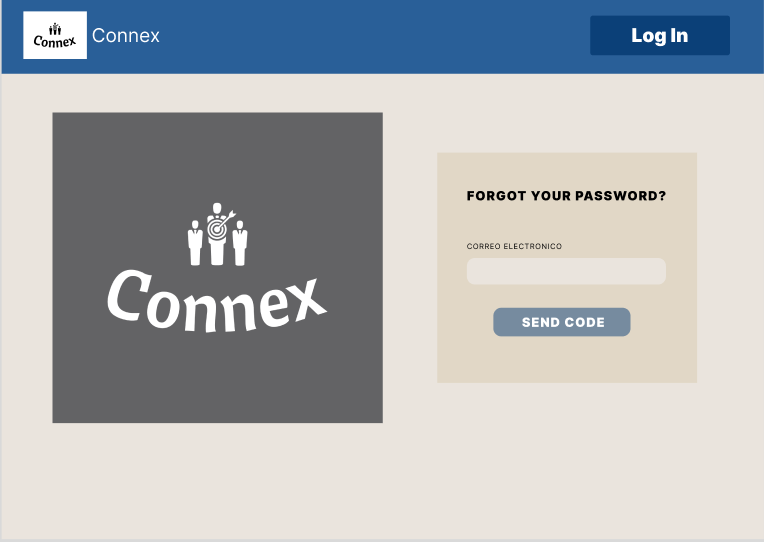
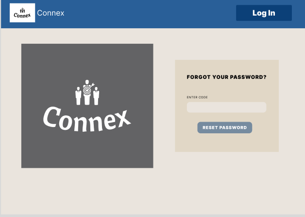
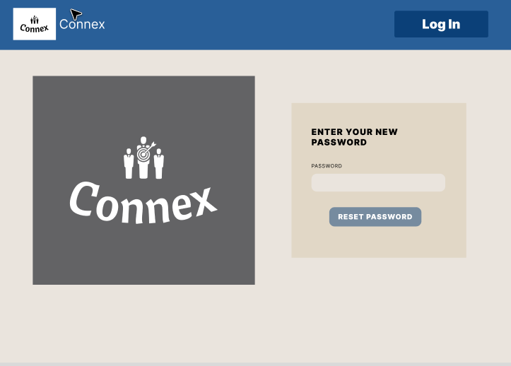
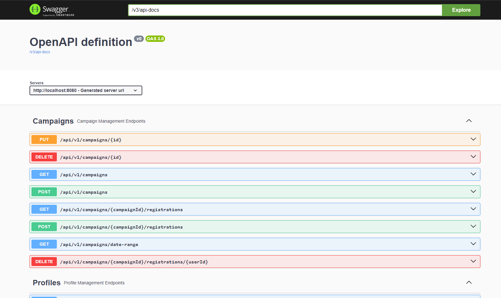

 

# Universidad Peruana de Ciencias Aplicadas

# INGENIERA DE SOFTWARE

# CURSO: SI729 Aplicaciones Open Source | SECCIÓN SW54 | 2024-2
 Profesor: Alberto Wilmer Sanchez Seña

**Startup:** Connex 

### Integrantes:
- Escobar Palomino, Sebastian Matias - U202125968
- Javier Murillo, Mathias - U202022211
- Macavilca Quispe, Ian - U202121325
- Nakasone Gomes, Marco Antonio - U202210790
- Laban Hijar, Jorge Armando - U201616054

---
# **Registro de versiones del Informe** 

| Version | Fecha | Autor | Descripcion de Modificacion |
| ----------- | ------------ | ---------- | ----------- |
| 0.0 | 20/08/2024 | Grupo 4 | Creación del documento |
| 1.0 | 25/09/2024 | Grupo 4 | TP |

# **Project Report Collaboration Insights**

**Commits del Informe**

Link del repositorio: 

# **Student Outcome**

**ABET - EAC - Student Outcome 3:** Capacidad de comunicarse efectivamente con un rango de audiencias.

|Criterio Especifico|Acciones Realizadas|Conclusiones|
|-|-|-|
|Comunica oralmente con efectividad a diferentes rangos de audiencia. | **Mathias Javier Murillo:**   **TB1:**   Durante la primera entrega del proyecto puede aprender como es el estudio de los competidores, el analisis de nuestros mercados objetivos y practique mis habilidades de desarrollo con la Landing Page.   **TP:**   Durante esta entrega pude implementar mis habilidades de desarrollo apoyando con el desarrollo del Web Application por el lado del frontend.   **Ian Macavilca Quispe:**   **TB1:**   En la primera entrega del proyecto, adquirí conocimientos sobre el análisis de competidores, el estudio de nuestros mercados objetivos, y tuve la oportunidad de mejorar mis habilidades de desarrollo al trabajar en la Landing Page.  **TP:**   En esta entrega, tuve la oportunidad de aplicar mis habilidades de desarrollo contribuyendo al desarrollo de la aplicación web, específicamente en la parte del frontend.  **Escobar Palomino, Sebastian:**  **TB1:**   En la primera fase del proyecto, adquirí conocimientos sobre cómo llevar a cabo un análisis de competidores y examinar nuestros mercados objetivo, además de mejorar mis habilidades de desarrollo trabajando en la Landing Page.  **TP:**   EEn esta etapa, apliqué mis habilidades técnicas colaborando en la implementación del frontend de la aplicación web.  **Laban Hijar, Jorge:**   **TB1:**   En la primera parte del proyecto, me familiaricé con el análisis de nuestros competidores y el estudio de los mercados clave, mientras fortalecía mis habilidades de programación trabajando en la Landing Page.  **TP:**   En esta fase, implementé mis conocimientos de desarrollo al contribuir en el desarrollo del frontend de la aplicación web.|
|Comunica por escrito con efectividad a diferentes rangos de audiencia.| **Mathias Javier Murillo:**   **TB1:**   Durante la primera entrega del proyecto desarrollo el capitulo 2, aprendiendo a como analizar a nuestros posibles competidores, creando estrategias frente a los mismos.   **TP:**   Durante esta entrega desarrollo la parte frontend del Web Application. **Ian Macavilca Quispe:**   **TB1:**   En la primera entrega del proyecto, desarrollé el capítulo 2, donde aprendí a analizar a nuestros posibles competidores y diseñé estrategias para enfrentarlos.   **TP:**   En esta entrega, me encargué de desarrollar la parte frontend de la aplicación web.   **Escobar Palomino, Sebastian:**  **TB1:**   En la primera entrega del proyecto, desarrollé el capítulo 2, donde aprendí a analizar a nuestros posibles competidores y diseñé estrategias para enfrentarlos.   **TP:**   En esta entrega, me encargué de desarrollar la parte frontend de la aplicación web.     **Laban Hijar, Jorge:**  **TB1:**   En la primera entrega del proyecto, desarrollé el capítulo 2, donde aprendí a analizar a nuestros posibles competidores y diseñé estrategias para enfrentarlos.   **TP:**   En esta entrega, me encargué de desarrollar la parte frontend de la aplicación web.  |

# Contenido

- [Registro de Versiones](#registro-de-versiones-del-informe)
- [Project Report Collaboration Insights](#project-report-collaboration-insights)
- [Student Outcome](#student-outcome)
1. [Capítulo I: Introducción](#capítulo-i-introducción) 
   1.1. [Startup Profile](#11-startup-profile) 
      1.1.1. [Descripción del startup](#111-descripcion-del-startup) 
      1.1.2. [Perfiles de los integrantes del equipo](#112-perfiles-de-los-integrantes-del-equipo) 
   1.2. [Solution Profile](#12-solution-profile) 
      1.2.1. [Antecedentes y Problemática](#121-antecedentes-y-problemática) 
      1.2.2. [Lean UX Process](#122-lean-ux-process) 
        1.2.2.1. [Lean UX Problem Statements](#1221-lean-ux-problem-statements) 
        1.2.2.2. [Lean UX Assumptions](#1222-lean-ux-assumptions) 
        1.2.2.3. [Lean UX Hypothesis Statements](#1223-lean-ux-hypothesis-statements) 
        1.2.2.4. [Lean UX Canvas](#1224-lean-ux-canvas) 
   1.3. [Segmentos objetivo](#13-segmentos-objetivo) 
2. [Capítulo II: Requirements Elicitation & Analysis](#capítulo-ii-requirements-elicitation-analysis) 
   2.1. [Competidores](#21-competidores) 
      2.1.1. [Análisis competitivo](#211-análisis-competitivo) 
      2.1.2. [Estrategias y tácticas frente a competidores](#212-estrategias-y-tácticas-frente-a-competidores) 
   2.2. [Entrevistas](#22-entrevistas) 
      2.2.1. [Diseño de entrevistas](#221-diseño-de-entrevistas) 
      2.2.2. [Registro de entrevistas](#222-registro-de-entrevistas) 
      2.2.3. [Análisis de entrevistas](#223-análisis-de-entrevistas) 
   2.3. [Needfinding](#23-needfinding) 
      2.3.1. [User Personas](#231-user-personas) 
      2.3.2. [User Task Matrix](#232-user-task-matrix) 
      2.3.3. [User Journey Mapping](#233-user-journey-mapping) 
      2.3.4. [Empathy Mapping](#234-empathy-mapping) 
      2.3.5. [As-is Scenario Mapping](#235-as-is-scenario-mapping) 
   2.4. [Ubiquitous Language](#24-ubiquitous-language) 
3. [Capítulo III: Requirements Specification](#capítulo-iii-requirements-specification) 
   3.1. [To-Be Scenario Mapping](#31-to-be-scenario-mapping) 
   3.2. [User Stories](#32-user-stories) 
   3.3. [Impact Mapping](#33-impact-mapping) 
   3.4. [Product Backlog](#34-product-backlog) 
4. [Capítulo IV: Product Design](#capítulo-iv-product-design) 
   4.1. [Style Guidelines](#41-style-guidelines) 
      4.1.1. [General Style Guidelines](#411-general-style-guidelines) 
      4.1.2. [Web Style Guidelines](#412-web-style-guidelines) 
   4.2. [Information Architecture](#42-information-architecture) 
      4.2.1. [Organization Systems](#421-organization-systems) 
      4.2.2. [Labeling Systems](#422-labeling-systems) 
      4.2.3. [SEO Tags and Meta Tags](#423-seo-tags-and-meta-tags) 
      4.2.4. [Searching Systems](#424-searching-systems) 
      4.2.5. [Navigation Systems](#425-navigation-systems) 
   4.3. [Landing Page UI Design](#43-landing-page-ui-design) 
      4.3.1. [Landing Page Wireframe](#431-landing-page-wireframe) 
      4.3.2. [Landing Page Mock-up](#432-landing-page-mock-up) 
   4.4. [Web Applications UX/UI Design](#44-web-applications-ux-ui-design) 
      4.4.1. [Web Applications Wireframes](#441-web-applications-wireframes) 
      4.4.2. [Web Applications Wireflow Diagrams](#442-web-applications-wireflow-diagrams) 
      4.4.3. [Web Applications Mock-ups](#443-web-applications-mock-ups) 
      4.4.4. [Web Applications User Flow Diagrams](#444-web-applications-user-flow-diagrams) 
   4.5. [Web Applications Prototyping](#45-web-applications-prototyping) 
   4.6. [Domain-Driven Software Architecture](#46-domain-driven-software-architecture) 
      4.6.1. [Software Architecture Context Diagram](#461-software-architecture-context-diagram) 
      4.6.2. [Software Architecture Container Diagrams](#462-software-architecture-container-diagrams) 
      4.6.3. [Software Architecture Components Diagrams](#463-software-architecture-components-diagrams) 
   4.7. [Software Object-Oriented Design](#47-software-object-oriented-design) 
      4.7.1. [Class Diagrams](#471-class-diagrams) 
      4.7.2. [Class Dictionary](#472-class-dictionary) 
   4.8. [Database Design](#48-database-design) 
      4.8.1. [Database Diagram](#481-database-diagram) 
5. [Capítulo V: Product Implementation, Validation & Deployment](#capítulo-v-product-implementation-validation--deployment) 
   5.1. [Software Configuration Management](#51-software-configuration-management) 
      5.1.1. [Software Development Environment Configuration](#511-software-development-environment-configuration) 
      5.1.2. [Source Code Management](#512-source-code-management) 
      5.1.3. [Source Code Style Guide & Conventions](#513-source-code-style-guide--conventions) 
      5.1.4. [Software Deployment Configuration](#514-software-deployment-configuration) 
   5.2. [Landing Page, Services & Applications Implementation](#52-landing-page-services--applications-implementation) 
      5.2.1. [Sprint 1](#521-sprint-1) 
         5.2.1.1. [Sprint Planning 1](#5211-sprint-planning-1) 
         5.2.1.2. [Sprint Backlog 1](#5212-sprint-backlog-1) 
         5.2.1.3. [Development Evidence for Sprint Review](#5213-development-evidence-for-sprint-review) 
         5.2.1.4. [Testing Suite Evidence for Sprint Review](#5214-testing-suite-evidence-for-sprint-review) 
         5.2.1.5. [Execution Evidence for Sprint Review](#5215-execution-evidence-for-sprint-review) 
         5.2.1.6. [Services Documentation Evidence for Sprint Review](#5216-services-documentation-evidence-for-sprint-review) 
         5.2.1.7. [Software Deployment Evidence for Sprint Review](#5217-software-deployment-evidence-for-sprint-review) 
         5.2.1.8. [Team Collaboration Insights during Sprint](#5218-team-collaboration-insights-during-sprint) 
      5.2.2. [Sprint 2](#522-sprint-2) 
         5.2.2.1. [Sprint Planning 2](#5221-sprint-planning-2) 
         5.2.2.2. [Sprint Backlog 2](#5222-sprint-backlog-2) 
         5.2.2.3. [Development Evidence for Sprint Review](#5223-development-evidence-for-sprint-review) 
         5.2.2.4. [Testing Suite Evidence for Sprint Review](#5224-testing-suite-evidence-for-sprint-review) 
         5.2.2.5. [Execution Evidence for Sprint Review](#5225-execution-evidence-for-sprint-review) 
         5.2.2.6. [Services Documentation Evidence for Sprint Review](#5226-services-documentation-evidence-for-sprint-review) 
         5.2.2.7. [Software Deployment Evidence for Sprint Review](#5227-software-deployment-evidence-for-sprint-review) 
         5.2.2.8. [Team Collaboration Insights during Sprint](#5228-team-collaboration-insights-during-sprint) 
      5.2.3. [Sprint 3](#523-sprint-3) 
         5.2.3.1. [Sprint Planning 3](#5231-sprint-planning-3) 
         5.2.3.2. [Sprint Backlog 3](#5232-sprint-backlog-3) 
         5.2.3.3. [Development Evidence for Sprint Review](#5233-development-evidence-for-sprint-review) 
         5.2.3.4. [Testing Suite Evidence for Sprint Review](#5234-testing-suite-evidence-for-sprint-review) 
         5.2.3.5. [Execution Evidence for Sprint Review](#5235-execution-evidence-for-sprint-review) 
         5.2.3.6. [Services Documentation Evidence for Sprint Review](#5236-services-documentation-evidence-for-sprint-review) 
         5.2.3.7. [Software Deployment Evidence for Sprint Review](#5237-software-deployment-evidence-for-sprint-review) 
         5.2.3.8. [Team Collaboration Insights during Sprint](#5238-team-collaboration-insights-during-sprint) 
      5.2.4. [Sprint 4](#524-sprint-4) 
         5.2.4.1. [Sprint Planning 4](#5241-sprint-planning-4) 
         5.2.4.2. [Sprint Backlog 4](#5242-sprint-backlog-4) 
         5.2.4.3. [Development Evidence for Sprint Review](#5243-development-evidence-for-sprint-review) 
         5.2.4.4. [Testing Suite Evidence for Sprint Review](#5244-testing-suite-evidence-for-sprint-review) 
         5.2.4.5. [Execution Evidence for Sprint Review](#5245-execution-evidence-for-sprint-review) 
         5.2.4.6. [Services Documentation Evidence for Sprint Review](#5246-services-documentation-evidence-for-sprint-review) 
         5.2.4.7. [Software Deployment Evidence for Sprint Review](#5247-software-deployment-evidence-for-sprint-review) 
         5.2.4.8. [Team Collaboration Insights during Sprint](#5248-team-collaboration-insights-during-sprint) 
   5.3. [Validation Interviews](#53-validation-interviews) 
      5.3.1. [Diseño de Entrevistas](#531-diseño-de-entrevistas) 
      5.3.2. [Registro de Entrevistas](#532-registro-de-entrevistas) 
      5.3.3. [Evaluaciones según Heurísticas](#533-evaluaciones-según-heurísticas) 
   5.4. [Video About-the-Product](#54-video-about-the-product) 
6. [Conclusiones](#conclusiones) 
7. [Bibliografía](#bibliografía) 
8. [Anexos](#anexos)

# **Capítulo I: Introducción** 

## **1.1. Startup Profile**
En un mundo cada vez más digitalizado, donde las relaciones entre marcas e influencers juegan un papel crucial en la estrategia de marketing, surge Connex. Con un enfoque claro en la innovación y un compromiso con la excelencia, nuestro equipo está compuesto por profesionales con experiencia en marketing digital, desarrollo de software, y gestión empresarial, quienes trabajan en sinergia para hacer de Connex una plataforma líder en su sector.

### **1.1.1. Descripcion de la Startup** 
Connex es una plataforma digital que facilita la interacción y colaboración entre influencers de todos los niveles y empresas de diversos sectores. Las empresas pueden acceder a una amplia gama de influencers, analizar sus portafolios y estadísticas, y elegir aquellos que mejor se alineen a sus objetivos de marketing y comunicación con Connex. De manera similar, los influencers pueden conectarse con empresas interesadas en promocionar sus bienes o servicios, estableciendo relaciones de beneficio mutuo.
### **1.1.2. Perfiles de los integrantes del equipo**

|**Integrantes**|**Descripción del Perfil**|
| :-: | :-: |
|**Escobar Palomino , Sebastian Matias (U202125968)**|Como estudiante de ingeniería de software, me comprometo a contribuir al máximo en el grupo y a cumplir con las entregas dentro del plazo establecido, manteniendo una comunicación efectiva con mis compañeros y aplicando mis habilidades para desarrollar las tareas asignadas en este proyecto.|
|**Javier Murillo, Mathias (U202022211)**|Siendo estudiante de Ingeniería de Software, me permite aportar con mis conocimientos desarrollados a lo largo de mi formación como ingeniero, esperando dar un gran apoyo y relevancia en el equipo. |
|**Macavilca Quispe, Ian (U202121325)**|Como estudiante de Ingeniería de Software, mi destreza en el pensamiento lógico me habilita para abordar desafíos de manera eficaz, optimizar procesos, diseñar software robusto, comunicar de manera clara, ser resiliente ante obstáculos y colaborar efectivamente en equipos, con lo que pienso aportar al éxito y eficiencia de la startup.|
|**Nakasone Gomes, Marco Antonio (U202210790)**|Soy estudiante de Ingeniería de software, tengo cualidades como la perseverancia, que me va a ayudar a ser resiliente ante cualquier adversidad que se nos presente más adelante en el trabajo y tambien soy buen compañero de trabajo que siempre quiere lo mejor para su grupo.|
|**Laban Hijar, Jorge Armandod (U201616054)**| Soy estudiante de Ingeniería de Software en la Universidad Peruana de Ciencias Aplicadas (UPC). A lo largo de mi carrera, he desarrollado una gran pasión por la tecnología y el desarrollo de software. Me interesa mucho cómo la tecnología puede resolver problemas complejos y mejorar la vida de las personas, y siempre busco aprender y actualizarme en las últimas tendencias del sector. |

## **1.2. Solution Profile** 
### **1.2.1. Antecedentes y problemáticas** 

**What?**

Connex es una plataforma creada para facilitar y optimizar la conexión entre empresas e influencers, permitiendo que ambos encuentren socios estratégicos de manera eficiente. La plataforma ofrece herramientas que simplifican el proceso de identificación, selección y gestión de colaboraciones entre marcas e influencers.

**Why?**

Porque las empresas enfrentan crecientes desafíos para encontrar influencers que realmente representen sus valores y lleguen a su audiencia objetivo. Al mismo tiempo, los influencers necesitan plataformas confiables que les ofrezcan oportunidades de colaboración con marcas relevantes. La falta de un espacio centralizado para gestionar estas relaciones lleva a procesos ineficientes, decisiones desacertadas y oportunidades perdidas.

**Where?**

Este problema es global, afectando tanto a pequeñas como a grandes empresas que buscan expandir su presencia digital a través del marketing de influencers. De igual manera, influencers en todo el mundo se ven limitados por la falta de herramientas que les permitan gestionar sus colaboraciones de manera efectiva.

**When?**

La necesidad surge a medida que el marketing de influencers se convierte en una estrategia central para las empresas, que buscan diferenciarse y conectar con audiencias de manera auténtica. Los influencers, por su parte, requieren una gestión más profesional de sus colaboraciones para maximizar su impacto y crecimiento.

**Who?**

Las principales partes afectadas son las empresas, que necesitan encontrar influencers adecuados para sus campañas, y los influencers, que buscan oportunidades de colaboración que se alineen con su marca personal. Ambos grupos enfrentan desafíos en la gestión de estas relaciones sin una plataforma especializada como Connex.

**How?**

Connex aborda esta problemática proporcionando una plataforma integral que permite a las empresas y a los influencers conectarse de manera eficiente. A través de Connex, las empresas pueden revisar portafolios de influencers y establecer colaboraciones estratégicas, mientras que los influencers pueden acceder a oportunidades relevantes para potenciar su carrera.

### **1.2.2. Lean UX Process** 
#### **1.2.2.1. Lean UX Problem Statments** 
**Domain**

Connex opera en el dominio del marketing digital, específicamente en el ámbito de las plataformas de conexión entre empresas e influencers. Este sector se enfoca en facilitar colaboraciones estratégicas entre marcas y creadores de contenido, potenciando el alcance y la efectividad de las campañas de marketing.

**Customer Segments**

Connex se dirige a dos segmentos principales de clientes:

- Empresas de diversos sectores (tecnología, moda, belleza, alimentos, etc.) que buscan incrementar su visibilidad y penetración en el mercado mediante campañas de marketing de influencers.

- Influencers de diferentes niveles (microinfluencers, influencers medianos y grandes) que buscan oportunidades de colaboración con marcas que se alineen con su audiencia y contenido.

**Pain Points**

- Empresas: Dificultad para identificar y seleccionar influencers que verdaderamente representen sus valores y lleguen a la audiencia deseada. Además, la falta de una plataforma confiable complica la gestión de múltiples colaboraciones.

- Influencers: Limitaciones para encontrar oportunidades de colaboración con marcas relevantes y para gestionar sus acuerdos de manera eficiente, lo que a menudo lleva a pérdidas de ingresos y crecimiento limitado.

**Gap**

En el mercado actual, no existe una plataforma centralizada y especializada que simplifique y optimice el proceso de conexión entre empresas e influencers. Las herramientas existentes son fragmentadas, ineficientes y no ofrecen una solución completa para gestionar todas las etapas de la colaboración, desde la búsqueda hasta la ejecución y el seguimiento.

**Vision/Strategy**

La visión de Connex es convertirse en la plataforma líder a nivel mundial que conecta de manera efectiva a empresas e influencers, transformando la forma en que se gestionan las relaciones de marketing digital. Nuestra estrategia se centra en:

- Crear un ecosistema confiable que facilite la identificación, selección y gestión de colaboraciones.
- Ofrecer herramientas avanzadas que permitan a las empresas analizar el impacto de sus campañas y a los influencers gestionar sus acuerdos de manera profesional.
- Expandir gradualmente el alcance de la plataforma, comenzando con un enfoque en sectores específicos y ampliando a otros mercados a medida que se establezca la base de usuarios.

**Initial Segment**

Connex se enfocará primero en el mercado peruano, dirigiéndose a empresas medianas, que son clave en el marketing de influencers. También se centrará en microinfluencers y medianos influencers en Perú, que buscan crecer y encontrar nuevas oportunidades de colaboración. Estos segmentos fueron elegidos por su alto potencial y necesidad de una plataforma eficiente como Connex.

#### **1.2.2.2. Lean UX Assumptions** 

**¿Quién es el usuario?**

Los usuarios de Connex son principalmente dos grupos:

- Empresas medianas que buscan conectar con influencers para aumentar su visibilidad y mejorar sus campañas de marketing.
- Microinfluencers y medianos influencers que desean acceder a oportunidades de colaboración con marcas relevantes para crecer y monetizar su influencia.

**¿Dónde encaja nuestro producto, en su trabajo o en su vida?**

Para las empresas, Connex se integra en su estrategia de marketing digital, facilitando la búsqueda y gestión de influencers para sus campañas. Para los influencers, Connex se convierte en una herramienta esencial en su vida profesional, ayudándolos a encontrar y gestionar colaboraciones que impulsen su carrera.

**¿Qué problema resuelve nuestro producto?**

Connex resuelve la dificultad de encontrar y gestionar colaboraciones eficaces entre empresas e influencers. Simplifica el proceso de identificación, contacto y seguimiento de las campañas, optimizando el tiempo y los recursos de ambas partes.

**¿Cuándo y cómo se utiliza nuestro producto?**

El producto se utiliza durante las fases de planificación, ejecución y seguimiento de campañas de marketing. Las empresas lo usan para buscar y seleccionar influencers, gestionar acuerdos y monitorear el rendimiento de las campañas. Los influencers lo usan para buscar oportunidades de colaboración y gestionar sus acuerdos con las marcas.

**¿Qué características son importantes?**

- Búsqueda avanzada y filtrado para encontrar influencers adecuados según criterios específicos.
- Portafolios detallados de influencers con métricas de rendimiento.
- Gestión de campañas para organizar y seguir el progreso de las colaboraciones.
- Herramientas de comunicación integradas para facilitar la negociación y coordinación.
- Análisis de rendimiento para medir el éxito de las campañas y la influencia.

**¿Cómo debe verse y comportarse nuestro producto?**

Connex debe tener una interfaz intuitiva y profesional, fácil de usar tanto para empresas como para influencers. El diseño debe ser limpio, moderno y accesible, con una navegación clara que permita a los usuarios encontrar rápidamente lo que necesitan. El comportamiento del producto debe ser fluido, respondiendo rápidamente a las acciones del usuario y proporcionando retroalimentación clara en cada paso.

#### **1.2.2.3. Lean UX Hypothesis Statements** 

**Usuario cliente**

Creemos que al ofrecer una plataforma digital que conecta eficientemente a empresas medianas del sector entretenimiento en Perú con microinfluencers y medianos influencers, permitiendo la gestión completa de colaboraciones y campañas,

Lograremos facilitar el proceso de marketing de influencers para las empresas y aumentaremos las oportunidades de colaboración y crecimiento para los influencers.

Sabremos que hemos tenido éxito cuando Connex se convierta en la plataforma líder en el sector del entretenimiento en Perú, con un número creciente de empresas e influencers registrados y activos en la plataforma.

#### **1.2.2.4. Lean UX Canvas** 

## **1.3. Segmentos objetivo** 

# **Capítulo II: Requeriments Elicitation & Analysis** 

## **2.1. Competidores** 

# Coobis
Coobis es una plataforma de marketing de contenidos que conecta distintas marcas con diferentes medios o tambien con influncers. Coobis llega a difundir el contenido entre mas de 5000 medios clasificados y puntuados, y además, amplifica el mensaje que los influencers o marcas quieran transmitir en diferentes redes sociales.

# Nuntia 
Nuntia, o anteriormente conocida como Blog on brands, es una empresa que se dedica a conectar bloggers con marcas. Esta empresa se basa en la influencia y la independencia. Por un lado, la influencia, porque un blog es lo que te hace diferente en un mundo virtual y, por otro lado, la independencia, porque es la clave que te convierte en influencer. 

# Brantube
Brantube se centra en los influences qu puedan contrar en la red social de Youtube. Trabajando de esta manera, tanto con influencers o Youtubers, como con empresas para que éstas contraten a los usuarios mas populares para conseguir que sus campañas sean mas exitosas. 

# Socialpubli
Socialpubli es una empresa de publicidad social que pone en contacto a empresas con personas influyentes del momento. De esta manera, los mensajes que las empresas quieren transmitir se pueden difundir a través de diferentes plataformas como Twitter, blogs o Facebook.

### **2.1.1. Analisis Competitivo** 

| Competitive Analysis Landscape | |
|--------------------------------| - |
| ¿Por qué llevar a cabo este análisis? | Este análisis es importante para nuestra startup, ya que, de este modo podemos darnos cuenta cuales son nuestras ventajas y desventajas estando dentro del mercado y como poder realizar diferentes estrategias para poder aprovechar nuestras ventajas y poder contrarestar nuestras desventajas. |

| | | Connex | Coobis | Nuntia |
|-|-|-|-|-|
| Perfil | Overview | Connex es una plataforma que conecta influencers con empresas generando estadisticas para los usuarios | Coobis es una plataforma de marketing de contenidos que conecta marcas con influencers | Nuntia es una empresa que se dedica a conectar bloggers con marcas |
|  | Ventaja competitiva ¿Qué valor ofrece a los clientes? | Connex ofrece caracteristica como poder ver tus estadisticas con una marca, poder subir tu alcance en diferentes redes y poder personalizar tu feed, mostrandolo como un portafolio | Facilitan el aumento de visibilidad de los influencers registrados y las marcas con las que trabajan | Genera conversaciones online, promocionan diferentes acciones y escuchan activamente a través de los bloggers que trabajan con ellos día a día |
|  | Mercado Objetivo | Influnecers y Empresas | Influencer y Empresas | Bloggers y Empresas |
| Perfil de Marketing | Estategia de Marketing | Segmentación y Posicionamiento, Propuesta de valor para marcas y creadores, SEO, Campañas PPC y Programas de referencia | Marketing de contenidos, Marketplaces de Influencers, Automatitación y Segmentación y Modelo de Monitoreo y Reporting | Distribución de Contenidos y Notas de Prensa, Publicidad Nativa y SEO |
| Perfil de Producto | Productos y servicios | | | |
|  | Precios y costos | | | |
|  | Canales de distribución (Web y/o Móvil) | Web | Web | Web | 

### **2.1.2. Estrategias y tácticas frente a competidores** 

| Competidores | | Connex | Coobis | Nuntia |
|-|-|-|-|-|
| Análisis SWOT | Fortalezas | | | |
| | Debilidades | | | |
| | Oportunidades | | | |
| | Amenazas | | | |

## **2.2. Entrevistas** 
### **2.2.1. Diseño de Entrevistas** 
### **2.2.2. Registro de entrevistas** 
### **2.2.3. Ánalisis de entrevistas** 

## **2.3. Needfinding** 
### **2.3.1. User Personas** 
### **2.3.2. User Task Matrix** 
### **2.3.3. User Journey Mapping** 
### **2.3.4. Empathy Mapping** 
### **2.3.5. As-is Scenario Mapping** 

## **2.4. Ubiquitous Language**

# **Capítulo III: Requirements Specification** 

## **3.1. To-Be Scenario Mapping**
## **3.2. User Stories** 
## **3.3. Impact Mapping** 
## **3.4. Product Backlog** 

# **Capítulo IV: Product Design** 

## **4.1. Style Guidelines** 
### **4.1.1. General Style Guidelines** 
### **4.1.2. Web Style Guidelines** 

## **4.2. Information Architecture** 
### **4.2.1. Organization Systems** 
### **4.2.2. Labeling Systems** 
### **4.2.3. SEO Tags and Meta Tags** 
### **4.2.4. Searching Systems** 
### **4.2.5. Navigation Systems** 

## **4.3. Landing Page UI Design** 
### **4.3.1. Landing Page Wireframe** 
### **4.3.2. Landing Page Mock-up** 

## **4.4. Web Applications UX/UI Design** 
### **4.4.1. Web Applications Wireframes** 
### **4.4.2. Web Applications Wireflow Diagrams** 
### **4.4.3. Web Applications Mock-ups** 
### **4.4.4. Web Applications User Flow Diagrams** 

## **4.5. Web Applications Prototyping** 

## **4.6. Domain-Driven Software Architecture** 
### **4.6.1. Software Architecture Context Diagram** 
### **4.6.2. Software Architecture Container Diagrams** 
### **4.6.3. Software Architecture Components Diagrams** 

## **4.7. Software Object-Oriented Design** 
### **4.7.1. Class Diagrams** 
### **4.7.2. Class Dictionary** 

## **4.8. Database Design** 
### **4.8.1. Database Diagram** 

# **Capítulo V: Product Implementation, Validation & Deployment**

## **5.1. Software Configuration Management**
### **5.1.1. Software Development Environment Configuration**
**Requirements Managment**
1. Figma: Plataforma de Elaboración de prototipos y edición gráfica, que usamos principalmente para la elaboración de los Wireframes y Mockups de nuestra Landing Page y Web Application, de igual manera se desarrollo nuestros Wireflow Diagrams en la misma plataforma.

**Software Development**
1. JetBrains WebStorm: Entorno de desarrollo especializado en el desarrollo web, usando accesos más simples para pruebas en distintos navegadores web, como, Chrome, Microsoft Edge, Safari y Mozilla Firefox. Usar este IDE nos agrega un valor para el desarrollo de nuestra startup, ya que, nos brinda la posiblidad de explorar y descubrir como funciona nuestros productos en diferentes entornos web.   Ruta de referencia: <https://www.jetbrains.com/es-es/webstorm/>
2. HTML5: Lenguaje utilizado para el etiquetado web. Es implementado para nuestro desarrollo de la startup, por el lado del Landing Page y en más adelante en nuestra Web Application, dandonos el contenido de las mismas.   Ruta de referencia: <https://www.w3schools.com/html/>
3. CSS: El Cascading Style Stheets, va juntos con HTML5, dandonos la opción de personalización de los estilos de nuestro contenido elaborado en HTML.   Ruta de referencia: <https://developer.mozilla.org/es/docs/Web/CSS>

**Software Deployment**
1. Git: Software de control de versiones, brindando eficiencia, confiabilidad y compatibilidad en el mantenimiento de versiones de nuestros productos y del mismo informe que desarrollamos. Todos los miembros del equipo accederán por medio de líneas de comando en su consola.   Ruta de referencia: <https://git-scm.com/>

**Software Documentation and Project Managment**
1. Github: Plataforma con la cual podemos alojar nuestros repositorios, utilizando el control de versiones de Git. Esto nos facilita la colaboración en tiempo real y en simultaneo, además, en la revisión de nuestros aportes por parte de los miembros del equipo.   Ruta de referencia: <https://github.com/>

### **5.1.2. Source Code Management**
El proyecto contiene las convenciones de flujo establecidas por el modelo GitFlow para el control de versiones usando Github como plataforma y sistema de control de versiones. Serán compartidos los URLs de nuestros repositorios, como, Landing Page y de igual manera se implementarán futuros productos de nuestra Startup

**Repositorios de Github**  
URL de acceso a nuestra organización de Github: <https://github.com/G4-UPC-PRE-SI729-2402-SW54-InnovaTech>    
URL de acceso a nuestra Landing Page: <https://github.com/G4-UPC-PRE-SI729-2402-SW54-InnovaTech/upc-pre-202402-si729-SW54-InnovaTech-landing-page>

### **5.1.3. Source Code Style Guide & Conventions**

El Lenguaje de Marcado de Hipertexto (HTML) es fundamental para estructurar y presentar el contenido en páginas web. La convención comúnmente utilizada para la página principal de un sitio web es nombrarla index.html.
Aquí están algunas convenciones clave para el uso de HTML:
1.	Utilizar nombres de elementos en minúsculas para mantener la consistencia y la legibilidad del código.
2.	Cerrar todos los elementos en HTML, es una buena práctica hacerlo para evitar problemas de compatibilidad y mejorar la claridad del código.
3.	Escribir comentarios cortos en una sola línea para una mayor claridad y organización del código.
4.	Evitar líneas de código excesivamente largas y agregar espacios en blanco solo cuando sea necesario para mejorar la organización del código.
5.	Nunca omitir elementos importantes como  `<title>` , `<html>`, `<body>`, y `<head>`, ya que desempeñan un papel crucial en la estructura y el contenido de la página.
6.	Incluir el atributo lang dentro de la etiqueta <html> para especificar el idioma de la página.
7.	Es importante especificar atributos como alt, ancho y altura para las imágenes para mejorar la accesibilidad y reducir el parpadeo.
8.	Evitar el uso de espacios alrededor de los signos en HTML para una mejor legibilidad.
9.	Es importante agregar siempre el elemento <meta> en todas las páginas para configurar la ventana gráfica de manera óptima.

Cascading Style Sheets (CSS) es un lenguaje utilizado para dar estilo y diseñar páginas web. Se considera una buena práctica seguir ciertas convenciones al escribir CSS para garantizar un código limpio y mantenible.
A continuación, se presentan algunas convenciones importantes para el uso de CSS:
1.	Mantener una nomenclatura coherente para clases, IDs y selectores, lo que facilita la comprensión del código para otros desarrolladores.
2.	Utiliza una indentación consistente y espacios en blanco para mejorar la legibilidad, incluyendo espacios después de los dos puntos en las reglas CSS.
3.	Emplea comentarios para documentar el código.
4.	Agrupa propiedades CSS relacionadas para una mejor organización del código.
5.	Evita selectores demasiado específicos que puedan causar conflictos o complicaciones a largo plazo.
6.	Usa prefijos vendor de manera coherente para asegurar compatibilidad con distintos navegadores.
7.	Optimiza el código CSS evitando la duplicación de reglas y combinando propiedades similares.
8.	Realiza pruebas en diversos navegadores y dispositivos para asegurar la consistencia del diseño, y valida el código CSS para evitar posibles errores de sintaxis mediante herramientas como el validador de CSS de W3C.

El lenguaje de programación JavaScript se utiliza para agregar interactividad y dinamismo a las páginas web. Al igual que con HTML y CSS, es importante seguir convenciones al escribir JavaScript para mantener un código claro y fácilmente mantenible. A continuación, se presentan algunas pautas importantes:
1.	Utiliza una nomenclatura consistente para variables, funciones y nombres de objetos en JavaScript.
2.	Mantén una indentación uniforme y utiliza espacios en blanco de manera adecuada para mejorar la legibilidad. Esto incluye dejar un espacio después de palabras clave como if, for, function, etc.
3.	Emplea comentarios para explicar la lógica detrás de ciertas partes del código. 
4.	Minimiza el uso de variables globales y prefiere el uso de ámbitos locales siempre que sea posible. 
5.	Asegúrate de manejar adecuadamente los errores y excepciones en tu código utilizando bloques try-catch o manejo de errores adecuado para garantizar una experiencia de usuario más robusta y libre de errores.
6.	Utiliza técnicas de optimización como el caching, la minimización y la concatenación de archivos para mejorar el rendimiento del código y reducir los tiempos de carga de la página.
7.	Realiza pruebas exhaustivas de tu código JavaScript en diferentes navegadores y dispositivos para asegurarte de que funcione correctamente en todas las plataformas.

Gherkin es un lenguaje simple y estructurado diseñado para escribir escenarios de prueba en un formato legible para humanos. Utiliza palabras clave predefinidas para describir el comportamiento del software, lo que facilita la colaboración entre los miembros del equipo técnico y no técnico
1.	Utiliza un lenguaje claro y comprensible para describir los escenarios en Gherkin, asegurándote de que sean fáciles de entender para todos los miembros del equipo.
2.	Mantén una estructura coherente en tus archivos de características de Gherkin, utilizando palabras clave como Feature, Scenario, Given, When, Then, y And de manera consistente para mantener la legibilidad.
3.	Describe los escenarios de manera detallada, utilizando las palabras clave como Given, When, y Then para proporcionar información clara sobre el estado inicial, las acciones y los resultados esperados.
4.	Identifica patrones comunes en tus escenarios y reutiliza pasos de escenarios existentes utilizando la palabra clave And para mantener la concisión y evitar la duplicación de código.
5.	Evita la inclusión de pasos redundantes o irrelevantes en tus escenarios de Gherkin para mantenerlos concisos y enfocados en los aspectos importantes del comportamiento del sistema.
6.	Utiliza comentarios para proporcionar contexto adicional o explicaciones sobre tus escenarios de Gherkin, especialmente útiles para explicar decisiones de diseño o comportamientos complejos.
7.	Colabora con otros miembros del equipo para revisar y refinar tus escenarios de Gherkin, asegurándote de que sean comprensibles y reflejen con precisión los requisitos del negocio.

### **5.1.4. Software Deployment Configuration**

Netlify es una plataforma de alojamiento web y despliegue continuo que simplifica el proceso de lanzamiento de sitios web y aplicaciones estáticas. Ofrece y funciona de la siguiente manera:

1. Se sincroniza con repositorios Git como GitHub, GitLab y Bitbucket. Al actualizar tu código y subirlo al repositorio, Netlify inicia automáticamente la construcción y publicación del sitio.
2. Emplea un sistema automatizado para transformar tu código (HTML, CSS, JavaScript) en un sitio estático. Durante la construcción, realiza tareas como compilar archivos y optimizar imágenes. Finalizada la construcción, despliega el sitio a través de su red CDN global.
3. Permite generar vistas previas automáticas para cada rama de tu repositorio, lo que facilita la visualización de cambios antes de integrarlos a la rama principal, favoreciendo la colaboración y revisión de código.
4. Netlify facilita la configuración de publicaciones automáticas para cada pull request o fusión en tu repositorio, activando la construcción y publicación con cada actualización, manteniendo tu sitio al día con la última versión del código.de construcción y despliegue, asegurando que tu sitio esté siempre actualizado con la última versión de tu código.

## **5.2. Landing Page, Services & Applications Implementation**
### **5.2.1. Sprint 1**
#### **5.2.1.1. Sprint Planning 1**
En la próxima sección, se presentará el sprint #1 con la primera versión del trabajo para la entrega del proyecto, donde se mostrará la organización, distribución y resultados del landing page.

Sprint # |Date |Time |Location |Prepared By |Attendees|
| :- | :- | :- | :- | :- | :- |
|1|28/08/2024 |7:00 pm|Reunión mediante Meet|Javier Murillo, Mathias|
Escobar Palomino, Sebastian. 

Macavilca Quispe, Ian.

Nakasone Gomes, Marco.

Laban Hijar, Jorge.
|
|Sprint 1 Goal |Sprint 1 Velocity |Sum of Story Points||||
|Elaborar y diseñar el landing page informativa para la aplicación Connex.|
18

|18||||

#### **5.2.1.2. Sprint Backlog 1**
En el primer sprint, el equipo se enfocó en crear una landing page atractiva y funcional, organizando y asignando tareas mediante el cuadro de Sprint según las habilidades de cada miembro.

|Sprint #||Sprint 1||||||
| :- | :- | :- | :- | :- | :- | :- | :- |
|User Story||Work Item / Task||||||
|Id|Title|Id|Title|Descripción|Estimación (Hours)|Assigned to|Status (In -process / To - review / Done)|
|US01|Descripción de la web|UT01|Acerca de la web|Descripción de lo que trata nuestra pagina web. |4|Mathias Javier|Done|
|US02|Accesibilidad del contenido|UT02|Disponibilidad accesible del contenido.|Que la página muestre el contenido correctamente (imágenes y enlaces).|8|Marco Nakasone y Sebastian Escobar|Done|
|US02|Accesibilidad del contenido|UT03|Diseño responsive de la página|Que la página se visualice correctamente en cualquier dispositivo.|6|Ian Macavilca|Done|

#### **5.2.1.3. Development Evidence for Sprint Review**

| Repository | Branch | Commit Id | Commit Message | Commit Message Body | Committed on (Date) |
|------------|--------|-----------|----------------|---------------------|---------------------|
| upc-pre-202402-si729-SW54-InnovaTech-landing-page | main |c5fcdad | Initial commit |  | Sep 2, 2024 |
| upc-pre-202402-si729-SW54-InnovaTech-landing-page | main |e35893a | Add files via upload |  | Sep 3, 2024 |
| upc-pre-202402-si729-SW54-InnovaTech-landing-page | develop |7838a81|fix: correct marco pic error|There was no picture of Marco in it, so it didn't appear on the page.  | Sep 3, 2024 |
| upc-pre-202402-si729-SW54-InnovaTech-landing-page | develop |6430f40|feat: add pics to service cards|  | Sep 3, 2024 |
| upc-pre-202402-si729-SW54-InnovaTech-landing-page | develop |53963b3|fix: navbar width bug|The navbar is not 100% wide, but now it is.| Sep 3, 2024 |
| upc-pre-202402-si729-SW54-InnovaTech-landing-page | feature/services |63a173d |feat: add blank footer |  | Sep 3, 2024 |
| upc-pre-202402-si729-SW54-InnovaTech-landing-page | feature/footer |bb99ea8 |feat: add pics for social media logos|  | Sep 3, 2024 |
| upc-pre-202402-si729-SW54-InnovaTech-landing-page | feature/footer |6cf28cc |fix: styles and footer design  |  | Sep 3, 2024 |
| upc-pre-202402-si729-SW54-InnovaTech-landing-page | feature/footer |573bd37 |fix: footer logos error  |  | Sep 3, 2024 |
| upc-pre-202402-si729-SW54-InnovaTech-landing-page | feature/footer |0cc9982 |fix(footer): fixed style css  |  | Sep 3, 2024 |
| upc-pre-202402-si729-SW54-InnovaTech-landing-page | feature/footer |c9daf0d |fix(header):menu compression and resposiveness  |  | Sep 4, 2024 |
| upc-pre-202402-si729-SW54-InnovaTech-landing-page | feature/contactus |18d08e8 |fix(home): fixed home image and text align  |  | Sep 4, 2024 |
| upc-pre-202402-si729-SW54-InnovaTech-landing-page | feature/contactus |4f5463f |fix(home):mixed class error  |  | Sep 4, 2024 |
| upc-pre-202402-si729-SW54-InnovaTech-landing-page | feature/contactus |10bf73b |feat(contactus):add contact us section  |  | Sep 4, 2024 |
| upc-pre-202402-si729-SW54-InnovaTech-landing-page | develop |86e3e91 |Merge pull request #1 from G4-UPC-PRE-SI729-2402-SW54-InnovaTech/feature/contactus  |  | Sep 4, 2024 |

#### **5.2.1.4. Testing Suite Evidence for Sprint Review**

| Repository | Branch | Commit Id | Commit Message | Commit Message Body | Committed on (Date) |
|------------|--------|-----------|----------------|---------------------|---------------------|
| Tests | main |468c3be | feat: added UT01 |  | Sep 6, 2024 |
| Tests | main |f2aaadb | feat: added UT02 |  | Sep 6, 2024 |
| Tests | main |ffbf018 | feat: added UT03 |  | Sep 6, 2024 |

#### **5.2.1.5. Execution Evidence for Sprint Review**
En el sprint 1 hemos logrado el desarrollo, diseño e implementación del Landing Page. En el mismo podemos encontrar las secciones que el usuario puede encontrar acerca de la Startup y del producto que estariamos ofreciendo. Ahora mostraremos las evidencias: 

1. Sección Home: En esta sección, el usuario podrá informarse un poco sobre lo que es nuestro producto junto con un botón para poder suscribirse. 

2. Sección About Us: En esta parte, el usuario podrá conocer a nuestro equipo de InnovaTech e informarse sobre quienes desarrollaron el producto. 

3. Sección For You: En esta sección el usuario podrá ver cuales son los servicios que le ofrecemos dentro de nuestro producto. 

4. Sección Contact Us: En esta parte, el usuario podrá ver las formas o maneras de poder contactarse con nosotros, en caso haya algún problema o requiera información extra. 

#### **5.2.1.6. Services Documentation Evidence for Sprint Review**
En esta sección se presentará la documentación relacionada con los servicios de conexión entre influencers y marcas a través de nuestra plataforma. Se incluirán los perfiles detallados de los influencers, con información sobre su audiencia, métricas clave de rendimiento y tarifas de colaboración, así como ejemplos de campañas anteriores y resultados obtenidos. Además, se proporcionarán detalles sobre las recomendaciones de marcas que han trabajado previamente con estos creadores de contenido.

#### **5.2.1.7. Software Deployment Evidence for Sprint Review**
Utilizando la herramienta de GitHub Pages completamos
la información que nos piden como la fuente y rama de donde
desplegaremos el trabajo, y luego de ellos nos brindará el link de
nuestro sitio web desplegado.

Aquí la pagina desplegada

Link de la landing page desplegada:. <https://g4-upc-pre-si729-2402-sw54-innovatech.github.io/upc-pre-202402-si729-SW54-InnovaTech-landing-page/>

#### **5.2.1.8. Team Collaboration Insights during Sprint**
Durante el desarrollo de este sprint, todos colaboramos de manera activa y continua para la elaboración de las task correspondientes. Mostramos la evidencia de los avances individuales:

Report:

Landing Page:

### **5.2.2. Sprint 2**
En este Sprint 2, nos hemos enfocado en consolidar las funcionalidades clave de nuestra Web Application para la startup Connex. El objetivo principal fue mejorar la visualización y acceso a los canales de comunicación internos, corregir errores en la Landing Page y refinar la documentación necesaria. Además, se corrigieron los errores detectados en el Sprint anterior, lo cual nos permitió avanzar con mayor claridad y solidez en el proyecto.

#### **5.2.2.1. Sprint Planning 2**

Para el Sprint Planning 2, el equipo de Connex ha establecido como prioridad la planificación de la estructura central de la Web Application, abarcando tanto la creación y acceso al repositorio como la visualización de los canales de comunicación para la empresa. Además, hemos identificado y abordado la corrección de errores de la Landing Page, con el objetivo de mantener la coherencia en la documentación y asegurar una entrega de calidad.
                                                                                                                                       
| Sprint # | Date       | Time     | Location             | Prepared By                 | Attendees                                                                                                                   | Sprint Goal                                                                                                                      | Sprint Velocity | Sum of Story Points |
| :-       | :-         | :-       | :-                   | :-                          | :-                                                                                                                          | :-                                                                                                                               | :-             | :-                  |
| 1        | 28/08/2024 | 7:00 pm  | Reunión mediante Meet | Javier Murillo, Mathias      | Escobar Palomino, Sebastian. Macavilca Quispe, Ian. Nakasone Gomes, Marco. Laban Hijar, Jorge.                      | Elaborar y diseñar el landing page informativa para la aplicación Connex.                                                        | 18             | 18                  |
| 2        | 24/09/2024 | 10:00 pm | Reunión mediante Meet | Javier Murillo, Mathias      | Escobar Palomino, Sebastian. Macavilca Quispe, Ian. Nakasone Gomes, Marco. Laban Hijar, Jorge.                      | La meta de este Sprint es la planificación de la Web Application para el startup, tanto su visualización, creación del repositorio, acceso al repositorio y la visualización de los canales de comunicación de la empresa. | x              | x                   |

#### **5.2.2.2. Sprint Backlog 2**

En el segundo sprint, el equipo se enfocó en crear una landing page atractiva y funcional, así como el desarrollo de la web aplication, organizando y asignando tareas mediante el cuadro de Sprint según las habilidades de cada miembro.

|Sprint #||Sprint 1||||||
| :- | :- | :- | :- | :- | :- | :- | :- |
|User Story||Work Item / Task||||||
|Id|Title|Id|Title|Descripción|Estimación (Hours)|Assigned to|Status |
|US02|Accesibilidad del contenido|UT01|Restructuración de la Pagina.|Que la página muestre el contenido correctamente (imágenes y enlaces).|4|Marco Nakasone y Sebastian Escobar|Done|
|US03|Autentificar perfil de usuario|UT02|Crear pagina de Login|Crear página base de login.|3|Mathias Javier|Done|
|US03|Autentificar perfil de usuario|UT03|Crear pagina de Register|Crear página base de register.|2|Mathias Javier|Done|
|US03|Autentificar perfil de usuario|UT04|Crear pagina de Forgoten Password|Crear página base de Forgoten Password.|4|Mathias Javier|Done|
|US03|Autentificar perfil de usuario|UT05|Rediseñar de primeras paginas base|Rediseñar las paginas de inicio y garantizar que sea responsive.|5|Ian Macavilca|Done|
|US04|Creación de portafolios personalizados por influencers|UT06|Crear interfaz de usuario para influencer|Desarrollo de las interfaces relacionadas al portafolio de influencers|5|Sebastian Escobar|In process|

#### **5.2.2.3. Development Evidence for Sprint Review**

| Repository | Branch | Commit Id | Commit Message | Commit Message Body | Committed on (Date) |
|------------|--------|-----------|----------------|---------------------|---------------------|
| upc-pre-202402-si729-SW54-InnovaTech-WebApplication-FrontEnd | main |b64465d | Initial commit |  | Sep 24, 2024 |
|  | main |640a2ad | chore:npm install |  | Sep 24, 2024 |
|  | login&register |7d38211 | chore:add forgo-password components |  | Sep 25, 2024 |
|  | login&register |689b03a | chore:add new design for login and register components |  | Sep 25, 2024 |
|  | login&register |689b03a | chore:add new design for login and register components |  | Sep 25, 2024 |
|  | user-interface |cd3cf9d | chore:add user-interface components |  | Sep 25, 2024 |

#### **5.2.2.4. Testing Suite Evidence for Sprint Review**
| Repository | Branch | Commit Id | Commit Message | Commit Message Body | Committed on (Date) |
|------------|--------|-----------|----------------|---------------------|---------------------|
|upc-pre-202402-si729-SW54-InnovaTech-landing-page | main |e35893a | Initial commit |  | Sep 24, 2024 |
|upc-pre-202402-si729-SW54-InnovaTech-WebApplication-FrontEnd |login&register |96cc01a | Initial commit |  | Sep 24, 2024 |

#### **5.2.2.5. Execution Evidence for Sprint Review**

Durante el sprint 2 se  desarrollo la implementación del landing page, la cual incluye varias secciones donde el usuario puede acceder a información relevante sobre el producto y la startup. Asimismo, se logró un avance parcial en el desarrollo de la aplicación web, permitiendo al usuario interactuar con ciertas funcionalidades. A continuación se presentan algunas evidencias.

#### **5.2.2.6. Services Documentation Evidence for Sprint Review**

En este momento no contamos con la evidencia de las la documentación de nuestros servicios ya que al ser el segundo sprint nos hemos enfocado unicamente en el front-end y esn nuestra landing page.

#### **5.2.2.7. Software Deployment Evidence for Sprint Review**

Para el desarrollo de nuestra primera versión del front-end, hemos usado con conjunto de stack de tecnologías:

**Git:** Es el sistema que nos ayudó permitiendonos trabajar en equipo en el desarrollo del proyecto.
 **GitHub:** Plataforma para el el desarrollo en equipo. 
**Git Hub Pages:** Este es el servicio que nos permite alojar nuestra landing page. 
**Evidencia del Deployment:** 
**Registro del usuario:** 

 **Inicio de sesión del usuario:**

 **Recupereción de contraseña:**

#### **5.2.2.8. Team Collaboration Insights during Sprint**
**Commits del Informe:** 

**Commits del WebApplication:**

### **5.2.3. Sprint 3**
En este Sprint 3, nos hemos enfocado en consolidar la parte lógica nuestra Web Application para nuestra startup Connex. El objetivo principal fue empezar el backend de nuestra aplicación en las que hemos agregado lógicas como la búsqueda, agregación y eliminación de usuarios influencers y empresas, hemos agregado también el registro de las campañas. Por ultimo hemos mejorado algunos aspectos que hemos detectado en el sprint anterior, lo cual esta ayudando a que mejores cada vez más nuestro proyecto. 

#### **5.2.3.1. Sprint Planning 3**

Para el Sprint Planning 3, el equipo de Connex ha establecido como prioridad la planificación del backend de nuestra Web Application, tratando de llevar acabo funcionalidades como las de agregar, eliminar y buscar, tanto usuarios influencers como empresas usuarias. A parte de eso seguimos mejorando otros aspectos de nuestro proyecto, como el frontend.  

| Sprint # | Date       | Time     | Location             | Prepared By                 | Attendees                                                                                                                   | Sprint Goal                                                                                                                      | Sprint Velocity | Sum of Story Points |
| -------- | ---------- | -------- | -------------------- | --------------------------- | --------------------------------------------------------------------------------------------------------------------------- | -------------------------------------------------------------------------------------------------------------------------------- | --------------- | -------------------- |
| 1        | 28/08/2024 | 7:00 pm  | Reunión mediante Meet | Javier Murillo, Mathias      | Escobar Palomino, Sebastian. Macavilca Quispe, Ian. Nakasone Gomes, Marco. Laban Hijar, Jorge.                      | Elaborar y diseñar el landing page informativa para la aplicación Connex.                                                        | 18              | 18                   |
| 2        | 24/09/2024 | 10:00 pm | Reunión mediante Meet | Javier Murillo, Mathias      | Escobar Palomino, Sebastian. Macavilca Quispe, Ian. Nakasone Gomes, Marco. Laban Hijar, Jorge.                      | La meta de este Sprint es la planificación de la Web Application para el startup, tanto su visualización, creación del repositorio, acceso al repositorio y la visualización de los canales de comunicación de la empresa. | x               | x                    |
| 3        | 10/10/2024 | 8:00 pm  | Reunión mediante Meet | Javier Murillo, Mathias      | Escobar Palomino, Sebastian. Macavilca Quispe, Ian. Nakasone Gomes, Marco. Laban Hijar, Jorge.                      | Consolidar la parte lógica del backend de la aplicación, integrando funcionalidades de agregar, eliminar y buscar a usuarios influencers y empresas. También agregar el regisntro de campañas. Por ultimo mejorar algunos aspectos que hemos identificados en el frontend del sprint anterior. | 20               | 20                    |

#### **5.2.3.2. Sprint Backlog 3**

En el primer sprint, el equipo se enfocó en crear una landing page atractiva y funcional, organizando y asignando tareas mediante el cuadro de Sprint según las habilidades de cada miembro.

|Sprint #||Sprint 3||||||
| :- | :- | :- | :- | :- | :- | :- | :- |
|User Story||Work Item / Task||||||
|Id|Title|Id|Title|Descripción|Estimación (Hours)|Assigned to|Status (In -process / To - review / Done)|
|US01|Descripción de la web|UT01|Acerca de la web|Descripción de lo que trata nuestra pagina web. |4|Mathias Javier|Done|
|US02|Accesibilidad del contenido|UT02|Disponibilidad accesible del contenido.|Que la página muestre el contenido correctamente (imágenes y enlaces).|8|Marco Nakasone y Sebastian Escobar|Done|
|US02|Accesibilidad del contenido|UT03|Diseño responsive de la página|Que la página se visualice correctamente en cualquier dispositivo.|6|Ian Macavilca|Done|

#### **5.2.3.3. Development Evidence for Sprint Review**
| Repository | Branch | Commit Message | Commit ID |
|------------|--------|----------------|-----------|
|InnovaTech-Web-services |development  |feat: Add Users Entities |1ce32a8  |
|InnovaTech-Web-services |development  |feat: Add UserController |9936b08  |
|InnovaTech-Web-services |profile  |feat: Add Profile Managment |fbf27ce  |
|InnovaTech-Web-services |campaign  |feat: Add Registration Entity for Campaign |9eb362b  |
|InnovaTech-Web-services |campaign  |feat: Add CampaignController |6454ef0  |
#### **5.2.3.4. Testing Suite Evidence for Sprint Review**
| Repository   | Branch  |  Commited on (Date)|
|------|-----------------------------------|----------------------------------------|
|[ https://github.com/G4-UPC-PRE-SI729-2402-SW54-InnovaTech/upc-pre-202402-si729-SW54-InnovaTech-report/tree/feature/chapter5](https://github.com/G4-UPC-PRE-SI729-2402-SW54-InnovaTech/upc-pre-202402-si729-SW54-InnovaTech-report/tree/main) | upc-pre-202402-si729-SW54-InnovaTech-report/main | 29/10/24 |
#### **5.2.3.5. Execution Evidence for Sprint Review**
Durante el sprint 3 se  desarrollo de webservices. Asimismo, 
se continuo con el avance en el desarrollo de la aplicación web, 
permitiendo al usuario interactuar con ciertas funcionalidades del frontend. 
A continuación se presentan algunas evidencias.

#### **5.2.3.6. Services Documentation Evidence for Sprint Review**
Diseñamos los endpoints como puntos de acceso específicos dentro de 
la aplicación web, que facilitan la comunicación entre el cliente y el servidor.
 Cada endpoint cuenta con una URL única y, al recibir una solicitud, el servidor
  la procesa y responde de acuerdo con la función específica asignada. 
  De este modo, funcionan como controladores que distribuyen las solicitudes 
  hacia distintas áreas de la aplicación, permitiendo desde la presentación de 
  información hasta la ejecución de operaciones en la base de datos. 
  La documentación de estos endpoints fue una prioridad para nosotros, 
  ya que permite a otros desarrolladores integrarse con facilidad y 
  entender cómo interactuar eficazmente con la aplicación.
#### **5.2.3.7. Software Deployment Evidence for Sprint Review**
#### **5.2.3.8. Team Collaboration Insights during Sprint**

### **5.2.4. Sprint 4**
#### **5.2.4.1. Sprint Planning 4**
#### **5.2.4.2. Sprint Backlog 4**
#### **5.2.4.3. Development Evidence for Sprint Review**
#### **5.2.4.4. Testing Suite Evidence for Sprint Review**
#### **5.2.4.5. Execution Evidence for Sprint Review**
#### **5.2.4.6. Services Documentation Evidence for Sprint Review**
#### **5.2.4.7. Software Deployment Evidence for Sprint Review**
#### **5.2.4.8. Team Collaboration Insights during Sprint**

## **5.3. Validation Interviews**
### **5.3.1. Diseño de Entrevistas**
 ***Segmento 1: Influencers***
 1. ¿Utilizas alguna otra aplicación para comunicarte con otras empresas?
 1. ¿Que te parecio la interacción con Connex?
 1. ¿Que es lo que modificarias o añadirias?
    
 ***Segmento 2: Dueños de Mascotas***
 1. ¿¿Que te parecio la interacción con Connex?
 1. ¿Que es lo que modificarias o añadirias?
 1. ¿Que tan facil te parecio el uso de Connex?
    
### **5.3.2. Registro de Entrevistas**

 ***Segmento 1: Influencers***

   **Entrevistado N°1: Gillary Ajalcriña**

- **Sexo: Femenino** 
- **Edad: 21 años**
- **Domicilio: La Molina** 

**Entrevista:** 

- **Link: https://upcedupe-my.sharepoint.com/personal/u202125968_upc_edu_pe/_layouts/15/stream.aspx?id=%2Fpersonal%2Fu202125968_upc_edu_pe%2FDocuments%2FEntrevista%20Gillary-%20Influencer%2Emp4&referrer=StreamWebApp%2EWeb&referrerScenario=AddressBarCopied%2Eview%2Efd83b39b-bd64-4f8d-ab1f-3b01f7dda579&isDarkMode=false**
- **Momento en el que Inicia: 0:00 min**
- **Duración: 4:30 min**

 **Entrevistado N°2: Gillary Ajalcriña**

### **5.3.3. Evaluaciones según Heurísticas**

## **5.4. Video About-the-Product**

# **Conclusiones**

# **Bibliografía**

# **Anexos**
1. Despliegue del Landing Page: <https://g4-upc-pre-si729-2402-sw54-innovatech.github.io/upc-pre-202402-si729-SW54-InnovaTech-landing-page/>
2. Figma con los Wireframes, MockUps y User Flow Diagrams, tanto del Landing como del Web Application: <https://www.figma.com/design/uXYz1dq5QRdRAHkwtRY8bz/InnovaTech?node-id=6-185&t=Ko92iM4B2N0ar8xW-1>
