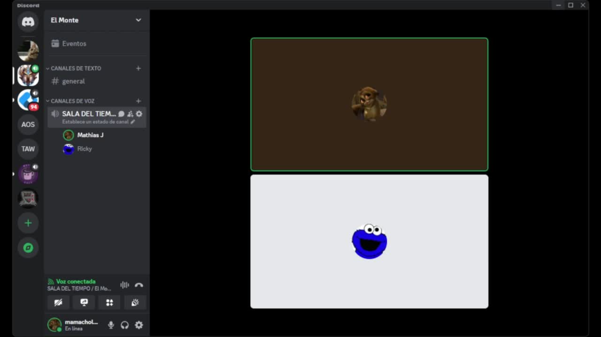
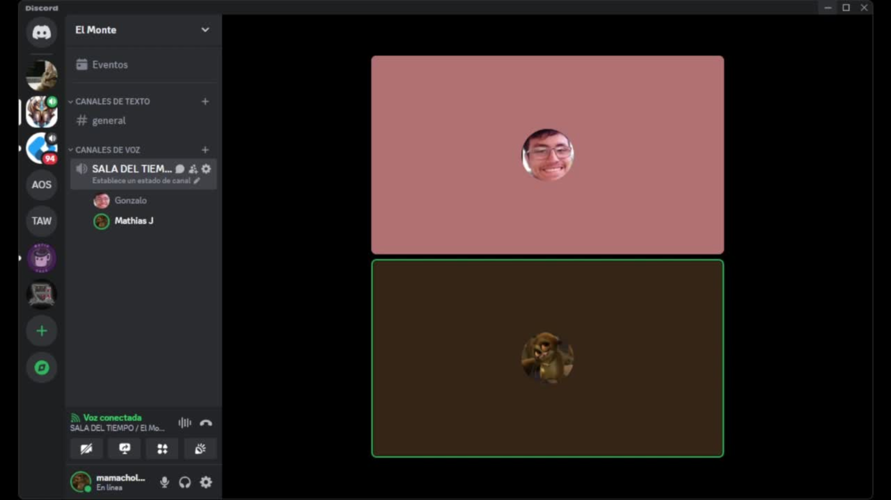
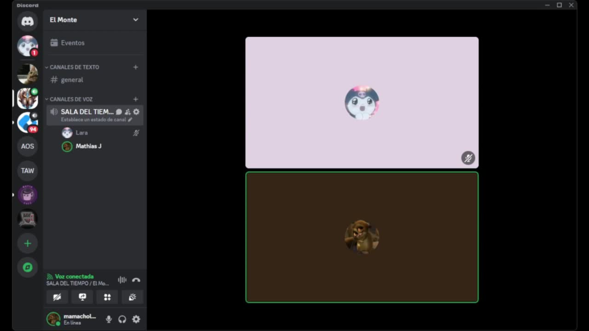
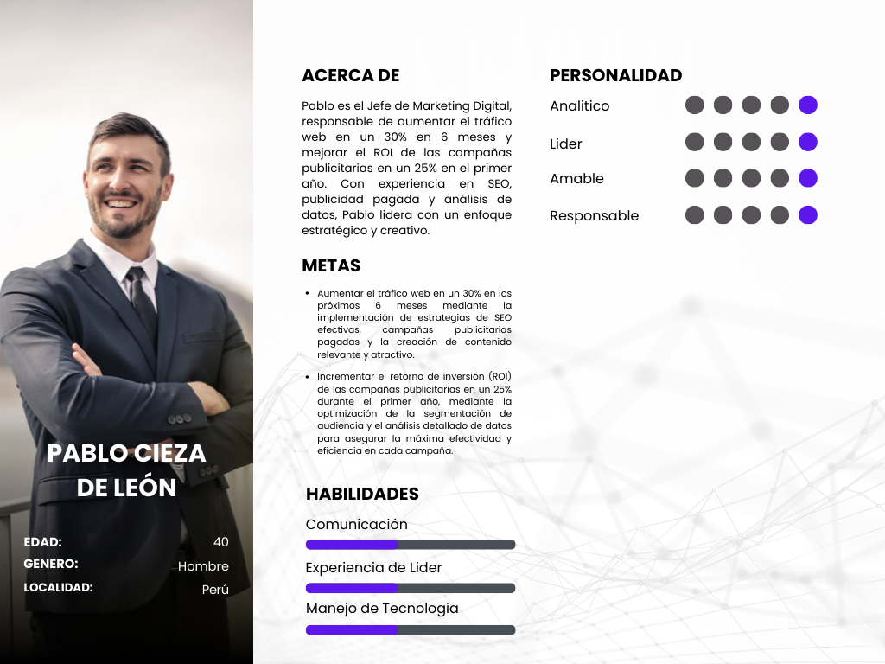

 

# Universidad Peruana de Ciencias Aplicadas

# INGENIERA DE SOFTWARE

# CURSO: SI729 Aplicaciones Open Source | SECCIÓN SW54 | 2024-2
 Profesor: Alberto Wilmer Sanchez Seña

**Startup:** Connex 

### Integrantes:
- Escobar Palomino, Sebastian Matias - U202125968
- Javier Murillo, Mathias - U202022211
- Macavilca Quispe, Ian - U202121325
- Nakasone Gomes, Marco Antonio - U202210790

---
# **Registro de versiones del Informe** 

| Version | Fecha | Autor | Descripcion de Modificacion |
| ----------- | ------------ | ---------- | ----------- |
| 0.0 | 20/08/2024 | Grupo 4 | Creación del documento |

# **Project Report Collaboration Insights**

**Commits del Informe**

Link del repositorio: 

# **Student Outcome**

**ABET - EAC - Student Outcome 3:** Capacidad de comunicarse efectivamente con un rango de audiencias.

# Contenido

- [Registro de Versiones](#registro-de-versiones-del-informe)
- [Project Report Collaboration Insights](#project-report-collaboration-insights)
- [Student Outcome](#student-outcome)
1. [Capítulo I: Introducción](#capítulo-i-introducción) 
   1.1. [Startup Profile](#11-startup-profile) 
      1.1.1. [Descripción del startup](#111-descripcion-del-startup) 
      1.1.2. [Perfiles de los integrantes del equipo](#112-perfiles-de-los-integrantes-del-equipo) 
   1.2. [Solution Profile](#12-solution-profile) 
      1.2.1. [Antecedentes y Problemática](#121-antecedentes-y-problemática) 
      1.2.2. [Lean UX Process](#122-lean-ux-process) 
        1.2.2.1. [Lean UX Problem Statements](#1221-lean-ux-problem-statements) 
        1.2.2.2. [Lean UX Assumptions](#1222-lean-ux-assumptions) 
        1.2.2.3. [Lean UX Hypothesis Statements](#1223-lean-ux-hypothesis-statements) 
        1.2.2.4. [Lean UX Canvas](#1224-lean-ux-canvas) 
   1.3. [Segmentos objetivo](#13-segmentos-objetivo) 
2. [Capítulo II: Requirements Elicitation & Analysis](#capítulo-ii-requirements-elicitation-analysis) 
   2.1. [Competidores](#21-competidores) 
      2.1.1. [Análisis competitivo](#211-análisis-competitivo) 
      2.1.2. [Estrategias y tácticas frente a competidores](#212-estrategias-y-tácticas-frente-a-competidores) 
   2.2. [Entrevistas](#22-entrevistas) 
      2.2.1. [Diseño de entrevistas](#221-diseño-de-entrevistas) 
      2.2.2. [Registro de entrevistas](#222-registro-de-entrevistas) 
      2.2.3. [Análisis de entrevistas](#223-análisis-de-entrevistas) 
   2.3. [Needfinding](#23-needfinding) 
      2.3.1. [User Personas](#231-user-personas) 
      2.3.2. [User Task Matrix](#232-user-task-matrix) 
      2.3.3. [User Journey Mapping](#233-user-journey-mapping) 
      2.3.4. [Empathy Mapping](#234-empathy-mapping) 
      2.3.5. [As-is Scenario Mapping](#235-as-is-scenario-mapping) 
   2.4. [Ubiquitous Language](#24-ubiquitous-language) 
3. [Capítulo III: Requirements Specification](#capítulo-iii-requirements-specification) 
   3.1. [To-Be Scenario Mapping](#31-to-be-scenario-mapping) 
   3.2. [User Stories](#32-user-stories) 
   3.3. [Impact Mapping](#33-impact-mapping) 
   3.4. [Product Backlog](#34-product-backlog) 
4. [Capítulo IV: Product Design](#capítulo-iv-product-design) 
   4.1. [Style Guidelines](#41-style-guidelines) 
      4.1.1. [General Style Guidelines](#411-general-style-guidelines) 
      4.1.2. [Web Style Guidelines](#412-web-style-guidelines) 
   4.2. [Information Architecture](#42-information-architecture) 
      4.2.1. [Organization Systems](#421-organization-systems) 
      4.2.2. [Labeling Systems](#422-labeling-systems) 
      4.2.3. [SEO Tags and Meta Tags](#423-seo-tags-and-meta-tags) 
      4.2.4. [Searching Systems](#424-searching-systems) 
      4.2.5. [Navigation Systems](#425-navigation-systems) 
   4.3. [Landing Page UI Design](#43-landing-page-ui-design) 
      4.3.1. [Landing Page Wireframe](#431-landing-page-wireframe) 
      4.3.2. [Landing Page Mock-up](#432-landing-page-mock-up) 
   4.4. [Web Applications UX/UI Design](#44-web-applications-ux-ui-design) 
      4.4.1. [Web Applications Wireframes](#441-web-applications-wireframes) 
      4.4.2. [Web Applications Wireflow Diagrams](#442-web-applications-wireflow-diagrams) 
      4.4.3. [Web Applications Mock-ups](#443-web-applications-mock-ups) 
      4.4.4. [Web Applications User Flow Diagrams](#444-web-applications-user-flow-diagrams) 
   4.5. [Web Applications Prototyping](#45-web-applications-prototyping) 
   4.6. [Domain-Driven Software Architecture](#46-domain-driven-software-architecture) 
      4.6.1. [Software Architecture Context Diagram](#461-software-architecture-context-diagram) 
      4.6.2. [Software Architecture Container Diagrams](#462-software-architecture-container-diagrams) 
      4.6.3. [Software Architecture Components Diagrams](#463-software-architecture-components-diagrams) 
   4.7. [Software Object-Oriented Design](#47-software-object-oriented-design) 
      4.7.1. [Class Diagrams](#471-class-diagrams) 
      4.7.2. [Class Dictionary](#472-class-dictionary) 
   4.8. [Database Design](#48-database-design) 
      4.8.1. [Database Diagram](#481-database-diagram) 
5. [Capítulo V: Product Implementation, Validation & Deployment](#capítulo-v-product-implementation-validation--deployment) 
   5.1. [Software Configuration Management](#51-software-configuration-management) 
      5.1.1. [Software Development Environment Configuration](#511-software-development-environment-configuration) 
      5.1.2. [Source Code Management](#512-source-code-management) 
      5.1.3. [Source Code Style Guide & Conventions](#513-source-code-style-guide--conventions) 
      5.1.4. [Software Deployment Configuration](#514-software-deployment-configuration) 
   5.2. [Landing Page, Services & Applications Implementation](#52-landing-page-services--applications-implementation) 
      5.2.1. [Sprint 1](#521-sprint-1) 
         5.2.1.1. [Sprint Planning 1](#5211-sprint-planning-1) 
         5.2.1.2. [Sprint Backlog 1](#5212-sprint-backlog-1) 
         5.2.1.3. [Development Evidence for Sprint Review](#5213-development-evidence-for-sprint-review) 
         5.2.1.4. [Testing Suite Evidence for Sprint Review](#5214-testing-suite-evidence-for-sprint-review) 
         5.2.1.5. [Execution Evidence for Sprint Review](#5215-execution-evidence-for-sprint-review) 
         5.2.1.6. [Services Documentation Evidence for Sprint Review](#5216-services-documentation-evidence-for-sprint-review) 
         5.2.1.7. [Software Deployment Evidence for Sprint Review](#5217-software-deployment-evidence-for-sprint-review) 
         5.2.1.8. [Team Collaboration Insights during Sprint](#5218-team-collaboration-insights-during-sprint) 
      5.2.2. [Sprint 2](#522-sprint-2) 
         5.2.2.1. [Sprint Planning 2](#5221-sprint-planning-2) 
         5.2.2.2. [Sprint Backlog 2](#5222-sprint-backlog-2) 
         5.2.2.3. [Development Evidence for Sprint Review](#5223-development-evidence-for-sprint-review) 
         5.2.2.4. [Testing Suite Evidence for Sprint Review](#5224-testing-suite-evidence-for-sprint-review) 
         5.2.2.5. [Execution Evidence for Sprint Review](#5225-execution-evidence-for-sprint-review) 
         5.2.2.6. [Services Documentation Evidence for Sprint Review](#5226-services-documentation-evidence-for-sprint-review) 
         5.2.2.7. [Software Deployment Evidence for Sprint Review](#5227-software-deployment-evidence-for-sprint-review) 
         5.2.2.8. [Team Collaboration Insights during Sprint](#5228-team-collaboration-insights-during-sprint) 
      5.2.3. [Sprint 3](#523-sprint-3) 
         5.2.3.1. [Sprint Planning 3](#5231-sprint-planning-3) 
         5.2.3.2. [Sprint Backlog 3](#5232-sprint-backlog-3) 
         5.2.3.3. [Development Evidence for Sprint Review](#5233-development-evidence-for-sprint-review) 
         5.2.3.4. [Testing Suite Evidence for Sprint Review](#5234-testing-suite-evidence-for-sprint-review) 
         5.2.3.5. [Execution Evidence for Sprint Review](#5235-execution-evidence-for-sprint-review) 
         5.2.3.6. [Services Documentation Evidence for Sprint Review](#5236-services-documentation-evidence-for-sprint-review) 
         5.2.3.7. [Software Deployment Evidence for Sprint Review](#5237-software-deployment-evidence-for-sprint-review) 
         5.2.3.8. [Team Collaboration Insights during Sprint](#5238-team-collaboration-insights-during-sprint) 
      5.2.4. [Sprint 4](#524-sprint-4) 
         5.2.4.1. [Sprint Planning 4](#5241-sprint-planning-4) 
         5.2.4.2. [Sprint Backlog 4](#5242-sprint-backlog-4) 
         5.2.4.3. [Development Evidence for Sprint Review](#5243-development-evidence-for-sprint-review) 
         5.2.4.4. [Testing Suite Evidence for Sprint Review](#5244-testing-suite-evidence-for-sprint-review) 
         5.2.4.5. [Execution Evidence for Sprint Review](#5245-execution-evidence-for-sprint-review) 
         5.2.4.6. [Services Documentation Evidence for Sprint Review](#5246-services-documentation-evidence-for-sprint-review) 
         5.2.4.7. [Software Deployment Evidence for Sprint Review](#5247-software-deployment-evidence-for-sprint-review) 
         5.2.4.8. [Team Collaboration Insights during Sprint](#5248-team-collaboration-insights-during-sprint) 
   5.3. [Validation Interviews](#53-validation-interviews) 
      5.3.1. [Diseño de Entrevistas](#531-diseño-de-entrevistas) 
      5.3.2. [Registro de Entrevistas](#532-registro-de-entrevistas) 
      5.3.3. [Evaluaciones según Heurísticas](#533-evaluaciones-según-heurísticas) 
   5.4. [Video About-the-Product](#54-video-about-the-product) 
6. [Conclusiones](#conclusiones) 
7. [Bibliografía](#bibliografía) 
8. [Anexos](#anexos)

# **Capítulo I: Introducción** 

## **1.1. Startup Profile**
En un mundo cada vez más digitalizado, donde las relaciones entre marcas e influencers juegan un papel crucial en la estrategia de marketing, surge Connex. Con un enfoque claro en la innovación y un compromiso con la excelencia, nuestro equipo está compuesto por profesionales con experiencia en marketing digital, desarrollo de software, y gestión empresarial, quienes trabajan en sinergia para hacer de Connex una plataforma líder en su sector.

### **1.1.1. Descripcion de la Startup** 
Connex es una plataforma digital que facilita la interacción y colaboración entre influencers de todos los niveles y empresas de diversos sectores. Las empresas pueden acceder a una amplia gama de influencers, analizar sus portafolios y estadísticas, y elegir aquellos que mejor se alineen a sus objetivos de marketing y comunicación con Connex. De manera similar, los influencers pueden conectarse con empresas interesadas en promocionar sus bienes o servicios, estableciendo relaciones de beneficio mutuo.
### **1.1.2. Perfiles de los integrantes del equipo**

|**Integrantes**|**Descripción del Perfil**|
| :-: | :-: |
|**Escobar Palomino , Sebastian Matias (U202125968)**|Como estudiante de ingeniería de software, me comprometo a contribuir al máximo en el grupo y a cumplir con las entregas dentro del plazo establecido, manteniendo una comunicación efectiva con mis compañeros y aplicando mis habilidades para desarrollar las tareas asignadas en este proyecto.|
|**Javier Murillo, Mathias (U202022211)**|Siendo estudiante de Ingeniería de Software, me permite aportar con mis conocimientos desarrollados a lo largo de mi formación como ingeniero, esperando dar un gran apoyo y relevancia en el equipo. |
|**Macavilca Quispe, Ian (U202121325)**|Como estudiante de Ingeniería de Software, mi destreza en el pensamiento lógico me habilita para abordar desafíos de manera eficaz, optimizar procesos, diseñar software robusto, comunicar de manera clara, ser resiliente ante obstáculos y colaborar efectivamente en equipos, con lo que pienso aportar al éxito y eficiencia de la startup.|
|**NOMBRE (U)**|Estudiando la carrera de |

## **1.2. Solution Profile** 
### **1.2.1. Antecedentes y problemáticas** 

**What?**

Connex es una plataforma creada para facilitar y optimizar la conexión entre empresas e influencers, permitiendo que ambos encuentren socios estratégicos de manera eficiente. La plataforma ofrece herramientas que simplifican el proceso de identificación, selección y gestión de colaboraciones entre marcas e influencers.

**Why?**

Porque las empresas enfrentan crecientes desafíos para encontrar influencers que realmente representen sus valores y lleguen a su audiencia objetivo. Al mismo tiempo, los influencers necesitan plataformas confiables que les ofrezcan oportunidades de colaboración con marcas relevantes. La falta de un espacio centralizado para gestionar estas relaciones lleva a procesos ineficientes, decisiones desacertadas y oportunidades perdidas.

**Where?**

Este problema es global, afectando tanto a pequeñas como a grandes empresas que buscan expandir su presencia digital a través del marketing de influencers. De igual manera, influencers en todo el mundo se ven limitados por la falta de herramientas que les permitan gestionar sus colaboraciones de manera efectiva.

**When?**

La necesidad surge a medida que el marketing de influencers se convierte en una estrategia central para las empresas, que buscan diferenciarse y conectar con audiencias de manera auténtica. Los influencers, por su parte, requieren una gestión más profesional de sus colaboraciones para maximizar su impacto y crecimiento.

**Who?**

Las principales partes afectadas son las empresas, que necesitan encontrar influencers adecuados para sus campañas, y los influencers, que buscan oportunidades de colaboración que se alineen con su marca personal. Ambos grupos enfrentan desafíos en la gestión de estas relaciones sin una plataforma especializada como Connex.

**How?**

Connex aborda esta problemática proporcionando una plataforma integral que permite a las empresas y a los influencers conectarse de manera eficiente. A través de Connex, las empresas pueden revisar portafolios de influencers y establecer colaboraciones estratégicas, mientras que los influencers pueden acceder a oportunidades relevantes para potenciar su carrera.

### **1.2.2. Lean UX Process** 
#### **1.2.2.1. Lean UX Problem Statments** 
**Domain**

Connex opera en el dominio del marketing digital, específicamente en el ámbito de las plataformas de conexión entre empresas e influencers. Este sector se enfoca en facilitar colaboraciones estratégicas entre marcas y creadores de contenido, potenciando el alcance y la efectividad de las campañas de marketing.

**Customer Segments**

Connex se dirige a dos segmentos principales de clientes:

- Empresas de diversos sectores (tecnología, moda, belleza, alimentos, etc.) que buscan incrementar su visibilidad y penetración en el mercado mediante campañas de marketing de influencers.

- Influencers de diferentes niveles (microinfluencers, influencers medianos y grandes) que buscan oportunidades de colaboración con marcas que se alineen con su audiencia y contenido.

**Pain Points**

- Empresas: Dificultad para identificar y seleccionar influencers que verdaderamente representen sus valores y lleguen a la audiencia deseada. Además, la falta de una plataforma confiable complica la gestión de múltiples colaboraciones.

- Influencers: Limitaciones para encontrar oportunidades de colaboración con marcas relevantes y para gestionar sus acuerdos de manera eficiente, lo que a menudo lleva a pérdidas de ingresos y crecimiento limitado.

**Gap**

En el mercado actual, no existe una plataforma centralizada y especializada que simplifique y optimice el proceso de conexión entre empresas e influencers. Las herramientas existentes son fragmentadas, ineficientes y no ofrecen una solución completa para gestionar todas las etapas de la colaboración, desde la búsqueda hasta la ejecución y el seguimiento.

**Vision/Strategy**

La visión de Connex es convertirse en la plataforma líder a nivel mundial que conecta de manera efectiva a empresas e influencers, transformando la forma en que se gestionan las relaciones de marketing digital. Nuestra estrategia se centra en:

- Crear un ecosistema confiable que facilite la identificación, selección y gestión de colaboraciones.
- Ofrecer herramientas avanzadas que permitan a las empresas analizar el impacto de sus campañas y a los influencers gestionar sus acuerdos de manera profesional.
- Expandir gradualmente el alcance de la plataforma, comenzando con un enfoque en sectores específicos y ampliando a otros mercados a medida que se establezca la base de usuarios.

**Initial Segment**

Connex se enfocará primero en el mercado peruano, dirigiéndose a empresas medianas, que son clave en el marketing de influencers. También se centrará en microinfluencers y medianos influencers en Perú, que buscan crecer y encontrar nuevas oportunidades de colaboración. Estos segmentos fueron elegidos por su alto potencial y necesidad de una plataforma eficiente como Connex.

#### **1.2.2.2. Lean UX Assumptions** 

**¿Quién es el usuario?**

Los usuarios de Connex son principalmente dos grupos:

- Empresas medianas que buscan conectar con influencers para aumentar su visibilidad y mejorar sus campañas de marketing.
- Microinfluencers y medianos influencers que desean acceder a oportunidades de colaboración con marcas relevantes para crecer y monetizar su influencia.

**¿Dónde encaja nuestro producto, en su trabajo o en su vida?**

Para las empresas, Connex se integra en su estrategia de marketing digital, facilitando la búsqueda y gestión de influencers para sus campañas. Para los influencers, Connex se convierte en una herramienta esencial en su vida profesional, ayudándolos a encontrar y gestionar colaboraciones que impulsen su carrera.

**¿Qué problema resuelve nuestro producto?**

Connex resuelve la dificultad de encontrar y gestionar colaboraciones eficaces entre empresas e influencers. Simplifica el proceso de identificación, contacto y seguimiento de las campañas, optimizando el tiempo y los recursos de ambas partes.

**¿Cuándo y cómo se utiliza nuestro producto?**

El producto se utiliza durante las fases de planificación, ejecución y seguimiento de campañas de marketing. Las empresas lo usan para buscar y seleccionar influencers, gestionar acuerdos y monitorear el rendimiento de las campañas. Los influencers lo usan para buscar oportunidades de colaboración y gestionar sus acuerdos con las marcas.

**¿Qué características son importantes?**

- Búsqueda avanzada y filtrado para encontrar influencers adecuados según criterios específicos.
- Portafolios detallados de influencers con métricas de rendimiento.
- Gestión de campañas para organizar y seguir el progreso de las colaboraciones.
- Herramientas de comunicación integradas para facilitar la negociación y coordinación.
- Análisis de rendimiento para medir el éxito de las campañas y la influencia.

**¿Cómo debe verse y comportarse nuestro producto?**

Connex debe tener una interfaz intuitiva y profesional, fácil de usar tanto para empresas como para influencers. El diseño debe ser limpio, moderno y accesible, con una navegación clara que permita a los usuarios encontrar rápidamente lo que necesitan. El comportamiento del producto debe ser fluido, respondiendo rápidamente a las acciones del usuario y proporcionando retroalimentación clara en cada paso.

#### **1.2.2.3. Lean UX Hypothesis Statements** 

**Usuario cliente**

Creemos que al ofrecer una plataforma digital que conecta eficientemente a empresas medianas del sector entretenimiento en Perú con microinfluencers y medianos influencers, permitiendo la gestión completa de colaboraciones y campañas,

Lograremos facilitar el proceso de marketing de influencers para las empresas y aumentaremos las oportunidades de colaboración y crecimiento para los influencers.

Sabremos que hemos tenido éxito cuando Connex se convierta en la plataforma líder en el sector del entretenimiento en Perú, con un número creciente de empresas e influencers registrados y activos en la plataforma.

#### **1.2.2.4. Lean UX Canvas** 

## **1.3. Segmentos objetivo** 

# **Capítulo II: Requeriments Elicitation & Analysis** 

## **2.1. Competidores** 

# Coobis
Coobis es una plataforma de marketing de contenidos que conecta distintas marcas con diferentes medios o tambien con influncers. Coobis llega a difundir el contenido entre mas de 5000 medios clasificados y puntuados, y además, amplifica el mensaje que los influencers o marcas quieran transmitir en diferentes redes sociales.

# Nuntia 
Nuntia, o anteriormente conocida como Blog on brands, es una empresa que se dedica a conectar bloggers con marcas. Esta empresa se basa en la influencia y la independencia. Por un lado, la influencia, porque un blog es lo que te hace diferente en un mundo virtual y, por otro lado, la independencia, porque es la clave que te convierte en influencer. 

# Brantube
Brantube se centra en los influences qu puedan contrar en la red social de Youtube. Trabajando de esta manera, tanto con influencers o Youtubers, como con empresas para que éstas contraten a los usuarios mas populares para conseguir que sus campañas sean mas exitosas. 

# Socialpubli
Socialpubli es una empresa de publicidad social que pone en contacto a empresas con personas influyentes del momento. De esta manera, los mensajes que las empresas quieren transmitir se pueden difundir a través de diferentes plataformas como Twitter, blogs o Facebook.

### **2.1.1. Analisis Competitivo** 

| Competitive Analysis Landscape |   |
|--------------------------------| - |
| ¿Por qué llevar a cabo este análisis? | Este análisis es importante para nuestra startup, ya que, de este modo podemos darnos cuenta cuales son nuestras ventajas y desventajas estando dentro del mercado y como poder realizar diferentes estrategias para poder aprovechar nuestras ventajas y poder contrarestar nuestras desventajas. |

| | | Connex | Coobis | Nuntia |
|-|-|-|-|-|
| Perfil | Overview | Connex es una plataforma que conecta influencers con empresas generando estadisticas para los usuarios | Coobis es una plataforma de marketing de contenidos que conecta marcas con influencers | Nuntia es una empresa que se dedica a conectar bloggers con marcas |
|  | Ventaja competitiva ¿Qué valor ofrece a los clientes? | Connex ofrece caracteristica como poder ver tus estadisticas con una marca, poder subir tu alcance en diferentes redes y poder personalizar tu feed, mostrandolo como un portafolio | Facilitan el aumento de visibilidad de los influencers registrados y las marcas con las que trabajan | Genera conversaciones online, promocionan diferentes acciones y escuchan activamente a través de los bloggers que trabajan con ellos día a día |
|  | Mercado Objetivo | Influnecers y Empresas | Influencer y Empresas | Bloggers y Empresas |
| Perfil de Marketing | Estategia de Marketing | Segmentación y Posicionamiento, Propuesta de valor para marcas y creadores, SEO, Campañas PPC y Programas de referencia | Marketing de contenidos, Marketplaces de Influencers, Automatitación y Segmentación y Modelo de Monitoreo y Reporting | Distribución de Contenidos y Notas de Prensa, Publicidad Nativa y SEO |
| Perfil de Producto | Productos y servicios | Aplicación web desarrollada para Influencer y marcas, que gestiona los vinculos entre ellos y sus estadisticas de manera personalizada por el propio usuario | Aplicacion web relaciona con el marketing de contenidos, que contecta marcas con influencers | Aplicacion web dedicada a relacionar bloggers con empresas |
|  | Precios y costos | Plan Free, Plan Premium (S/.29.99) y Plan Business (S/.19.99) | Se queda con 30% de tus colaboraciones | Tarifa de publicación varia entre 200 y 1000 dolarés, y puede llegar a más |
|  | Canales de distribución (Web y/o Móvil) | Web | Web | Web | 

### **2.1.2. Estrategias y tácticas frente a competidores** 

| Competidores | | Connex | Coobis | Nuntia |
|-|-|-|-|-|
| Análisis SWOT | Fortalezas | Herramienta de análisis para evaluar portafolios y estadísticas de influencers, Enfoque en establecer relaciones de beneficio mutuo entre influencers y empresas y Diversidad Sectorial, permitiendo que diversos sectores accedan a una gama amplia de incluencers | Amplia red de creadores de contenido  y herramientas de segmentación y automatización | Experiencia en distribución de contenido y notas de prensa, también contando una amplia red de medios de comunicación |
| | Debilidades | Competencia con plaformas ya establecidas en el mercado con un reputacion consolidada, Posibles limitaciones de recursos comparados con plataformas más grandes | Puede tener un enfoque limitado en influencers y los costos pueden ser elevados para algunas empresas | No enfocarse tanto en la colaboración directa con influencers, lo que puede limitar su alcance en el mercado de marketing de influencers |
| | Oportunidades | Crecimiento del marketing de influencers, Expansión de servicios y Mercados Internacionales | Expansión en el mercado de publicidad nativa y contenido patrocinado | Expansión de servicios para incluir nuevas formas de colaboración de contenido |
| | Amenazas | Competencia con plataformas ya establecidas y Saturación del mercado | Competencia de  plataformas emergentes | Competencia con plataformas especializadas en infñuencers y marketing digital |

## **2.2. Entrevistas** 
### **2.2.1. Diseño de Entrevistas** 

**Preguntas Generales**

1. ¿Cuales es tu nombre?
2. En caso seas parte una empresa ¿Cual es el tamaño de la empresa, en cuanto a trabajadores y marca?
3. En caso seas influencer ¿Que tipo de contenido produces? ¿Y para que redes?

**Preguntas para el Influencer**

1. ¿Que plataformas usas para gestionar tus campañas o conectar con marcas?
2. ¿Como llevas las estadísticas de tus redes despúes de una campaña?
3. ¿Que crees que es lo más importante al concretar una campaña con alguna marca?

**Preguntas para las empresas**

1. ¿Que tipo de contenido crees que es necesario para tu empresa?
2. ¿Te guías mucho por las estadísticas de los influencers a la hora de contactarlos para alguna campaña?
3. ¿Conoces alguna aplicación para poder establecer contacto o encontrar a el creador de contenido adecuado para el rubro de tu empresa?

### **2.2.2. Registro de entrevistas** 

**Segmento Empresas:**  

1. Entrevistado 1:
 - Nombres y Apellidos: Gonzalo Navarro
 - Edad: 27 años
 - Distrito: Magadalena
 - Evidencia de la reunión: 
 - Url de stream: <https://upcedupe.sharepoint.com/:v:/s/InnovaTech/EXVzM1Ijf6NGttX5r8txQEcBH4LF8op1HRvIuUdXHr_xSQ?nav=eyJyZWZlcnJhbEluZm8iOnsicmVmZXJyYWxBcHAiOiJTdHJlYW1XZWJBcHAiLCJyZWZlcnJhbFZpZXciOiJTaGFyZURpYWxvZy1MaW5rIiwicmVmZXJyYWxBcHBQbGF0Zm9ybSI6IldlYiIsInJlZmVycmFsTW9kZSI6InZpZXcifX0%3D&e=jLyT5a>
 - Timming y duración: 1:43 - 3:36
 - Resumen de la entrevista: 
La entrevista fue realizada a Gonzalo Navarro, tiene 27 años y reside en Magdalena del Mar. Gonzalo viene de una empresa la cual se encarga de distribuir y/o productos de cuidado personal. El busca influencers o creadores de contenido que tengan una apariencia fisica agradable para el consumidor, basadose mucho en las estadisticas de sus redes sociales, nos comenta que no conoce alguna aplicación para poder llegar a encontrar al creador de contenido adecuado para su público, muy aparte de los DM's de Instagram o Tiktok, y que estaría interesado en una plataforma de este estilo.

2. Entrevistado 2:
 - Nombres y Apellidos: Ricky Villanueva
 - Edad: 24 años
 - Distrito: La Victoria
 - Evidencia de la reunión: 
 - Url de stream: <https://upcedupe.sharepoint.com/:v:/s/InnovaTech/EXVzM1Ijf6NGttX5r8txQEcBH4LF8op1HRvIuUdXHr_xSQ?nav=eyJyZWZlcnJhbEluZm8iOnsicmVmZXJyYWxBcHAiOiJTdHJlYW1XZWJBcHAiLCJyZWZlcnJhbFZpZXciOiJTaGFyZURpYWxvZy1MaW5rIiwicmVmZXJyYWxBcHBQbGF0Zm9ybSI6IldlYiIsInJlZmVycmFsTW9kZSI6InZpZXcifX0%3D&e=jLyT5a>
 - Timming y duración: 0:00 - 1:43
 - Resumen de la entrevista:
La entrevista fue realizada a Ricky Villanueva, tiene 24 años y reside en La Victoria. Ricky viene de una empresa de cryptomonedas y desarrollo web. El busca influencers que creen contenido informativo sobre finanzas personales, economía o inversiones en cyptomonedas, prefiere personas que tengan alcance en redes mediano o alto, nos comenta que no ha tenido suerte para encontrar al creador de contenido adecuado para su público, y que estaría interesado en una plataforma de este estilo.

**Segmento Influencer:**  
1. Entrevistado 1:
 - Nombres y Apellidos: Lara Aguirre
 - Edad: 21 años
 - Distrito: San Isidro
 - Evidencia de la reunión: 
 - Url de stream: <https://upcedupe.sharepoint.com/:v:/s/InnovaTech/EXVzM1Ijf6NGttX5r8txQEcBH4LF8op1HRvIuUdXHr_xSQ?nav=eyJyZWZlcnJhbEluZm8iOnsicmVmZXJyYWxBcHAiOiJTdHJlYW1XZWJBcHAiLCJyZWZlcnJhbFZpZXciOiJTaGFyZURpYWxvZy1MaW5rIiwicmVmZXJyYWxBcHBQbGF0Zm9ybSI6IldlYiIsInJlZmVycmFsTW9kZSI6InZpZXcifX0%3D&e=jLyT5a>
 - Timming y duración: 3:36 - 4:49
 - Resumen de la entrevista:
La entrevista fue realizada a Lara Aguirre, tiene 22 años y reside en San Isidro. Lara crea contenido en redes sobre comida, siendo una foodieblogger. Ella nos comenta que no tiene algun lugar donde llevar sus estadisticas post-campañas, siendo esto un inconveniente para que más empresas la contacten. Nos comenta que a la hora de contactar con una marca, le es complicado poder tener confianza en la misma ya que no escucha o ve recomendaciones de la misma, y le gustaria una aplicación que le facilitara estas funciones.
### **2.2.3. Ánalisis de entrevistas** 

## **2.3. Needfinding** 
### **2.3.1. User Personas** 

**User Persona: Influencer:**
 

 
**User Persona: Empresa**
 

### **2.3.2. User Task Matrix** 
**Creadores de contenido para Redes Sociales (Influencers)**
|  |  User 1  | User 2 | User 3  | User 4 |
| --- | ----------- | ------------ | ----------- | ---------- |
| Saben como crear un portafolio atractivo  | SI   | NO| SI   | SI |
| Conocen herramientas de análisis de métricas | NO | NO        | SI         | NO       |
| Tienen experiencia gestionando múltiples campañas | SI | SI        | NO         | SI       | 
| Colaboran con marcas reconocidas | SI | NO        | NO         | NO       |

**Empresas con Marketing Digital** 
|  |  User 1  | User 2 | User 3  | User 4 |
| --- | ----------- | ------------ | ----------- | ---------- |
| Tienen un equipo dedicado al marketing digital  | SI   | SI| SI   | SI |
| Conocen el mercado de influencers | NO | NO        | POCO         | NO       |
| Pueden gestionar varias campañas a la vez | SI | SI        | POCO         | SI       | 
| Buscan influencers con alto alcance y reconocimiento | SI | SI        | SI         | SI       |
### **2.3.3. User Jorney Mapping** 
**Registro: ¿Por qué confirarían en nosotros?**
- Los usuarios potenciales investigan Connex en redes sociales, blogs, y articulos de terceros para validar su relevancia.
- Buscan reseñas y testimonios de otros influencers o empresas que ya han usado Connex.
- Evalúan nuestra propuesta de valor, las estadísticas y la transparencia sobre cómo funcionan las colaboraciones en la plataforma.

**Incorporación y Primer Uso: ¿Cómo pueden sentirse exitosos?**
- El proceso de registro y configuración del perfil es sencillo, con instrucciones claras y sin complicaciones.
- La interfaz de usuario es intuitiva, permitiendo encontrar fácilmente oportunidades, perfiles y funcionalidades clave.

**Compatir: ¿Por qué invitarían a otro?s**
- Los usuarios perciben el valor añadido en funcionalidades como herramientas de comunicación directa, sistemas de recomendación y seguimiento de métricas.
- La calidad de los proyectos, la facilidad para conectar con empresas/influencers, y los insights proporcionados fomenta confianza y satisfaccion.
- Se implementan programas de referidos, bonificaciones o acceso a funciones premium como motivación pra invitar a nuevos usuarios.
### **2.3.4. Empathy Mapping** 
**Empathy Map Segmento: Influencers**  
  
**Empathy Map Segmento: Empresas**  
  
### **2.3.5. As-is Scenario Mapping** 

## Influencers

| **Fases**   | **Fase 1: Descubrimiento**                  | **Fase 2: Registro y Configuración**      | **Fase 3: Búsqueda y Aplicación**            | **Fase 4: Colaboración y Evaluación**        |
|-------------|--------------------------------------------|------------------------------------------|---------------------------------------------|---------------------------------------------|
| **Doing**   | Buscando información sobre Connex en redes sociales y blogs. | Registrándose en la plataforma y creando su perfil. | Explorando oportunidades de colaboración y aplicando a campañas. | Coordinando la entrega de contenido y revisando métricas post-campaña. |
| **Thinking**| "¿Será esta la plataforma adecuada para mi crecimiento?" | "¿Cómo puedo crear un perfil atractivo?" | "¿Cuál es la campaña más alineada con mi audiencia?" | "¿Estoy entregando el contenido adecuado para la marca?" |
| **Feeling** | Curioso pero algo escéptico.               | Emocionado pero con algo de incertidumbre sobre la configuración. | Motivado pero ansioso por la competencia. | Confianza pero también algo de presión por cumplir con las expectativas. |

## Empresas

| **Fases**   | **Fase 1: Descubrimiento**                  | **Fase 2: Registro y Configuración**      | **Fase 3: Búsqueda y Selección de Influencers**| **Fase 4: Gestión de Campaña y Evaluación**   |
|-------------|--------------------------------------------|------------------------------------------|-----------------------------------------------|---------------------------------------------|
| **Doing**   | Investigando Connex como opción para marketing con influencers. | Registrándose en la plataforma y definiendo objetivos de marketing. | Explorando perfiles de influencers y seleccionando los adecuados. | Supervisando la ejecución de la campaña y revisando resultados. |
| **Thinking**| "¿Será Connex la mejor plataforma para conectar con influencers relevantes?" | "¿Cómo configuro mi perfil para atraer los influencers adecuados?" | "¿Qué influencers pueden aportar mayor valor a mi campaña?" | "¿El ROI de la campaña cumple con nuestras expectativas?" |
| **Feeling** | Interesado pero con dudas sobre la inversión. | Expectante y planificando estrategias. | Confiado pero atento a encontrar el match ideal. | Satisfecho si la campaña fue exitosa, o analizando posibles mejoras. |

## **2.4. Ubiquitous Language**

Este documento define el Lenguaje Ubicuo (Ubiquitous Language) que se utilizará en el proyecto Connex. Su propósito es garantizar una comunicación clara y consistente entre todos los miembros del equipo y stakeholders.

## Términos Clave

1. **Influencer**: Persona que crea contenido en plataformas digitales y tiene la capacidad de influir en su audiencia. En Connex, los influencers son usuarios que buscan oportunidades de colaboración con marcas para promocionar productos o servicios.

2. **Empresa**: Cliente o usuario en Connex que busca promocionar sus productos o servicios a través del marketing de influencers. Las empresas pueden registrarse, buscar y conectar con influencers adecuados para sus campañas de marketing.

3. **Colaboración**: Acuerdo entre una empresa y un influencer para crear contenido que promueva un producto, servicio o marca. Las colaboraciones pueden ser pagadas o basadas en intercambio de productos.

4. **Plataforma Connex**: Sistema digital donde empresas e influencers pueden interactuar, establecer conexiones y gestionar colaboraciones. Connex proporciona herramientas para la búsqueda, selección y análisis de resultados de campañas de influencers.

5. **Campaña de Marketing de Influencers**: Estrategia de promoción que implica a influencers para aumentar la visibilidad de una marca, mejorar el reconocimiento del producto, y/o incrementar las ventas. En Connex, las empresas crean campañas a las que los influencers pueden aplicar.

6. **Registro**: Proceso por el cual tanto influencers como empresas crean un perfil en Connex para acceder a las funciones de la plataforma.

7. **Perfil de Influencer**: Página dentro de Connex que contiene información sobre un influencer, como estadísticas de audiencia, contenido anterior, y detalles de contacto. Utilizado por las empresas para evaluar posibles colaboraciones.

8. **Brief de Campaña**: Documento proporcionado por la empresa que describe los objetivos, requisitos, y expectativas de una campaña específica. Incluye información clave como la audiencia objetivo, mensajes clave y métricas de éxito.

9. **Matching de Influencers**: Proceso por el cual Connex recomienda influencers a las empresas basándose en criterios específicos como el nicho de audiencia, la relevancia del contenido y la tasa de compromiso.

10. **Dashboard de Métricas**: Herramienta en Connex que proporciona estadísticas y datos sobre el rendimiento de campañas y colaboraciones. Las empresas e influencers pueden usar esta herramienta para evaluar el impacto de sus esfuerzos de marketing.

11. **ROI (Return on Investment)**: Métrica utilizada por las empresas para medir la efectividad de las campañas de marketing con influencers. En Connex, el ROI puede evaluarse a través del dashboard de métricas.

12. **Onboarding**: Proceso de introducción para nuevos usuarios (tanto influencers como empresas) en Connex. Incluye guías, tutoriales, y soporte inicial para garantizar que los usuarios comprendan cómo usar la plataforma.

13. **Comunicación Directa**: Herramienta dentro de Connex que permite la comunicación fluida entre empresas e influencers para discutir detalles de las colaboraciones, resolver dudas y alinear expectativas.

14. **Programa de Recompensas**: Sistema de incentivos dentro de Connex que motiva a los usuarios (especialmente influencers) a realizar acciones específicas, como invitar a otros usuarios a la plataforma o completar campañas exitosamente.

15. **Feedback de Campaña**: Opiniones y comentarios proporcionados por la empresa al influencer (y viceversa) después de la finalización de una colaboración. Este feedback es crucial para la mejora continua de las campañas futuras.

# **Capítulo III: Requirements Specification** 

## **3.1. To-Be Scenario Mapping**
## **3.2. User Stories** 
## **3.3. Impact Mapping** 
## **3.4. Product Backlog** 

# **Capítulo IV: Product Design** 

## **4.1. Style Guidelines** 
### **4.1.1. General Style Guidelines** 
### **4.1.2. Web Style Guidelines** 

## **4.2. Information Architecture** 
### **4.2.1. Organization Systems** 
### **4.2.2. Labeling Systems** 
### **4.2.3. SEO Tags and Meta Tags** 
### **4.2.4. Searching Systems** 
### **4.2.5. Navigation Systems** 

## **4.3. Landing Page UI Design** 
### **4.3.1. Landing Page Wireframe** 
### **4.3.2. Landing Page Mock-up** 

## **4.4. Web Applications UX/UI Design** 
### **4.4.1. Web Applications Wireframes** 
### **4.4.2. Web Applications Wireflow Diagrams** 
### **4.4.3. Web Applications Mock-ups** 
### **4.4.4. Web Applications User Flow Diagrams** 

## **4.5. Web Applications Prototyping** 

## **4.6. Domain-Driven Software Architecture** 
### **4.6.1. Software Architecture Context Diagram** 
### **4.6.2. Software Architecture Container Diagrams** 
### **4.6.3. Software Architecture Components Diagrams** 

## **4.7. Software Object-Oriented Design** 
### **4.7.1. Class Diagrams** 
### **4.7.2. Class Dictionary** 

## **4.8. Database Design** 
### **4.8.1. Database Diagram** 

# **Capítulo V: Product Implementation, Validation & Deployment**

## **5.1. Software Configuration Management**
### **5.1.1. Software Development Environment Configuration**
### **5.1.2. Source Code Management**
### **5.1.3. Source Code Style Guide & Conventions**
### **5.1.4. Software Deployment Configuration**

## **5.2. Landing Page, Services & Applications Implementation**
### **5.2.1. Sprint 1**
#### **5.2.1.1. Sprint Planning 1**
#### **5.2.1.2. Sprint Backlog 1**
#### **5.2.1.3. Development Evidence for Sprint Review**
#### **5.2.1.4. Testing Suite Evidence for Sprint Review**
#### **5.2.1.5. Execution Evidence for Sprint Review**
#### **5.2.1.6. Services Documentation Evidence for Sprint Review**
#### **5.2.1.7. Software Deployment Evidence for Sprint Review**
#### **5.2.1.8. Team Collaboration Insights during Sprint**

### **5.2.2. Sprint 2**
#### **5.2.2.1. Sprint Planning 2**
#### **5.2.2.2. Sprint Backlog 2**
#### **5.2.2.3. Development Evidence for Sprint Review**
#### **5.2.2.4. Testing Suite Evidence for Sprint Review**
#### **5.2.2.5. Execution Evidence for Sprint Review**
#### **5.2.2.6. Services Documentation Evidence for Sprint Review**
#### **5.2.2.7. Software Deployment Evidence for Sprint Review**
#### **5.2.2.8. Team Collaboration Insights during Sprint**

### **5.2.3. Sprint 3**
#### **5.2.3.1. Sprint Planning 3**
#### **5.2.3.2. Sprint Backlog 3**
#### **5.2.3.3. Development Evidence for Sprint Review**
#### **5.2.3.4. Testing Suite Evidence for Sprint Review**
#### **5.2.3.5. Execution Evidence for Sprint Review**
#### **5.2.3.6. Services Documentation Evidence for Sprint Review**
#### **5.2.3.7. Software Deployment Evidence for Sprint Review**
#### **5.2.3.8. Team Collaboration Insights during Sprint**

### **5.2.4. Sprint 4**
#### **5.2.4.1. Sprint Planning 4**
#### **5.2.4.2. Sprint Backlog 4**
#### **5.2.4.3. Development Evidence for Sprint Review**
#### **5.2.4.4. Testing Suite Evidence for Sprint Review**
#### **5.2.4.5. Execution Evidence for Sprint Review**
#### **5.2.4.6. Services Documentation Evidence for Sprint Review**
#### **5.2.4.7. Software Deployment Evidence for Sprint Review**
#### **5.2.4.8. Team Collaboration Insights during Sprint**

## **5.3. Validation Interviews**
### **5.3.1. Diseño de Entrevistas**
### **5.3.2. Registro de Entrevistas**
### **5.3.3. Evaluaciones según Heurísticas**

## **5.4. Video About-the-Product**

# **Conclusiones**

# **Bibliografía**

# **Anexos**
