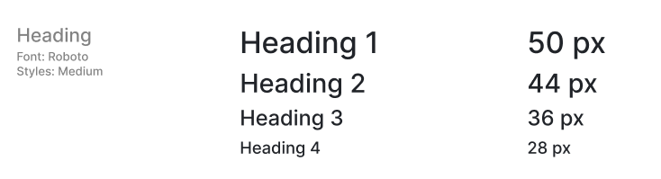
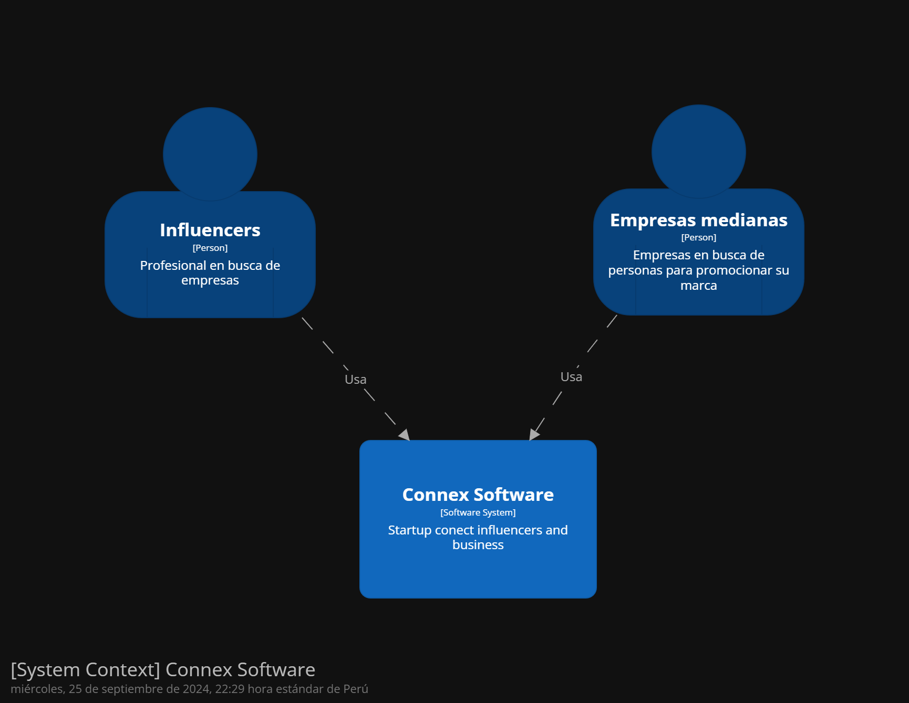
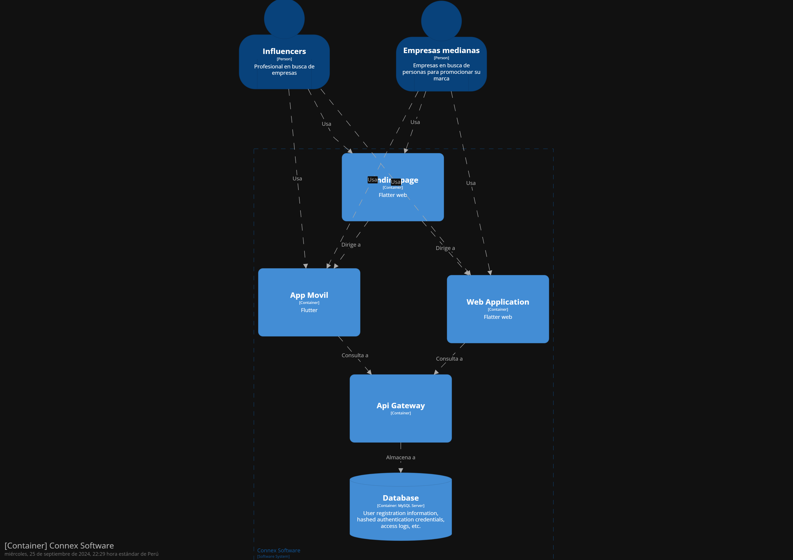
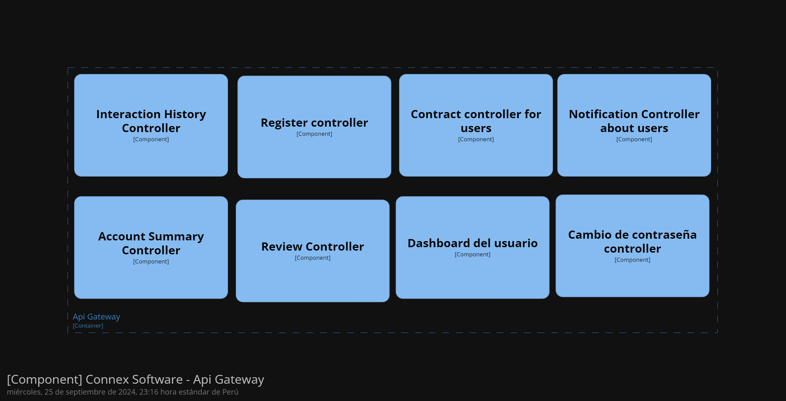

<div align="center">


</p> 

# Universidad Peruana de Ciencias Aplicadas

# INGENIERA DE SOFTWARE

# CURSO: SI729 Aplicaciones Open Source | SECCIÓN SW54 | 2024-2
 Profesor: Alberto Wilmer Sanchez Seña

**Startup:** Connex 

### Integrantes:
- Escobar Palomino, Sebastian Matias - U202125968
- Javier Murillo, Mathias - U202022211
- Macavilca Quispe, Ian - U202121325
- Nakasone Gomes, Marco Antonio - U202210790
</div>

---
# **Registro de versiones del Informe** 

| Version | Fecha | Autor | Descripcion de Modificacion |
| ----------- | ------------ | ---------- | ----------- |
| 0.0 | 20/08/2024 | Grupo 4 | Creación del documento |


# **Project Report Collaboration Insights**

**Commits del Informe**

Link del repositorio: 

# **Student Outcome**

**ABET - EAC - Student Outcome 3:** Capacidad de comunicarse efectivamente con un rango de audiencias.


# Contenido

- [Registro de Versiones](#registro-de-versiones-del-informe)
- [Project Report Collaboration Insights](#project-report-collaboration-insights)
- [Student Outcome](#student-outcome)
1. [Capítulo I: Introducción](#capítulo-i-introducción)<br>
   1.1. [Startup Profile](#11-startup-profile)<br>
      1.1.1. [Descripción del startup](#111-descripcion-del-startup)<br>
      1.1.2. [Perfiles de los integrantes del equipo](#112-perfiles-de-los-integrantes-del-equipo)<br>
   1.2. [Solution Profile](#12-solution-profile)<br>
      1.2.1. [Antecedentes y Problemática](#121-antecedentes-y-problemática)<br>
      1.2.2. [Lean UX Process](#122-lean-ux-process)<br>
        1.2.2.1. [Lean UX Problem Statements](#1221-lean-ux-problem-statements)<br>
        1.2.2.2. [Lean UX Assumptions](#1222-lean-ux-assumptions)<br>
        1.2.2.3. [Lean UX Hypothesis Statements](#1223-lean-ux-hypothesis-statements)<br>
        1.2.2.4. [Lean UX Canvas](#1224-lean-ux-canvas)<br>
   1.3. [Segmentos objetivo](#13-segmentos-objetivo)<br>
2. [Capítulo II: Requirements Elicitation & Analysis](#capítulo-ii-requirements-elicitation-analysis)<br>
   2.1. [Competidores](#21-competidores)<br>
      2.1.1. [Análisis competitivo](#211-análisis-competitivo)<br>
      2.1.2. [Estrategias y tácticas frente a competidores](#212-estrategias-y-tácticas-frente-a-competidores)<br>
   2.2. [Entrevistas](#22-entrevistas)<br>
      2.2.1. [Diseño de entrevistas](#221-diseño-de-entrevistas)<br>
      2.2.2. [Registro de entrevistas](#222-registro-de-entrevistas)<br>
      2.2.3. [Análisis de entrevistas](#223-análisis-de-entrevistas)<br>
   2.3. [Needfinding](#23-needfinding)<br>
      2.3.1. [User Personas](#231-user-personas)<br>
      2.3.2. [User Task Matrix](#232-user-task-matrix)<br>
      2.3.3. [User Journey Mapping](#233-user-journey-mapping)<br>
      2.3.4. [Empathy Mapping](#234-empathy-mapping)<br>
      2.3.5. [As-is Scenario Mapping](#235-as-is-scenario-mapping)<br>
   2.4. [Ubiquitous Language](#24-ubiquitous-language)<br>
3. [Capítulo III: Requirements Specification](#capítulo-iii-requirements-specification)<br>
   3.1. [To-Be Scenario Mapping](#31-to-be-scenario-mapping)<br>
   3.2. [User Stories](#32-user-stories)<br>
   3.3. [Impact Mapping](#33-impact-mapping)<br>
   3.4. [Product Backlog](#34-product-backlog)<br>
4. [Capítulo IV: Product Design](#capítulo-iv-product-design)<br>
   4.1. [Style Guidelines](#41-style-guidelines)<br>
      4.1.1. [General Style Guidelines](#411-general-style-guidelines)<br>
      4.1.2. [Web Style Guidelines](#412-web-style-guidelines)<br>
   4.2. [Information Architecture](#42-information-architecture)<br>
      4.2.1. [Organization Systems](#421-organization-systems)<br>
      4.2.2. [Labeling Systems](#422-labeling-systems)<br>
      4.2.3. [SEO Tags and Meta Tags](#423-seo-tags-and-meta-tags)<br>
      4.2.4. [Searching Systems](#424-searching-systems)<br>
      4.2.5. [Navigation Systems](#425-navigation-systems)<br>
   4.3. [Landing Page UI Design](#43-landing-page-ui-design)<br>
      4.3.1. [Landing Page Wireframe](#431-landing-page-wireframe)<br>
      4.3.2. [Landing Page Mock-up](#432-landing-page-mock-up)<br>
   4.4. [Web Applications UX/UI Design](#44-web-applications-ux-ui-design)<br>
      4.4.1. [Web Applications Wireframes](#441-web-applications-wireframes)<br>
      4.4.2. [Web Applications Wireflow Diagrams](#442-web-applications-wireflow-diagrams)<br>
      4.4.3. [Web Applications Mock-ups](#443-web-applications-mock-ups)<br>
      4.4.4. [Web Applications User Flow Diagrams](#444-web-applications-user-flow-diagrams)<br>
   4.5. [Web Applications Prototyping](#45-web-applications-prototyping)<br>
   4.6. [Domain-Driven Software Architecture](#46-domain-driven-software-architecture)<br>
      4.6.1. [Software Architecture Context Diagram](#461-software-architecture-context-diagram)<br>
      4.6.2. [Software Architecture Container Diagrams](#462-software-architecture-container-diagrams)<br>
      4.6.3. [Software Architecture Components Diagrams](#463-software-architecture-components-diagrams)<br>
   4.7. [Software Object-Oriented Design](#47-software-object-oriented-design)<br>
      4.7.1. [Class Diagrams](#471-class-diagrams)<br>
      4.7.2. [Class Dictionary](#472-class-dictionary)<br>
   4.8. [Database Design](#48-database-design)<br>
      4.8.1. [Database Diagram](#481-database-diagram)<br>
5. [Capítulo V: Product Implementation, Validation & Deployment](#capítulo-v-product-implementation-validation--deployment)<br>
   5.1. [Software Configuration Management](#51-software-configuration-management)<br>
      5.1.1. [Software Development Environment Configuration](#511-software-development-environment-configuration)<br>
      5.1.2. [Source Code Management](#512-source-code-management)<br>
      5.1.3. [Source Code Style Guide & Conventions](#513-source-code-style-guide--conventions)<br>
      5.1.4. [Software Deployment Configuration](#514-software-deployment-configuration)<br>
   5.2. [Landing Page, Services & Applications Implementation](#52-landing-page-services--applications-implementation)<br>
      5.2.1. [Sprint 1](#521-sprint-1)<br>
         5.2.1.1. [Sprint Planning 1](#5211-sprint-planning-1)<br>
         5.2.1.2. [Sprint Backlog 1](#5212-sprint-backlog-1)<br>
         5.2.1.3. [Development Evidence for Sprint Review](#5213-development-evidence-for-sprint-review)<br>
         5.2.1.4. [Testing Suite Evidence for Sprint Review](#5214-testing-suite-evidence-for-sprint-review)<br>
         5.2.1.5. [Execution Evidence for Sprint Review](#5215-execution-evidence-for-sprint-review)<br>
         5.2.1.6. [Services Documentation Evidence for Sprint Review](#5216-services-documentation-evidence-for-sprint-review)<br>
         5.2.1.7. [Software Deployment Evidence for Sprint Review](#5217-software-deployment-evidence-for-sprint-review)<br>
         5.2.1.8. [Team Collaboration Insights during Sprint](#5218-team-collaboration-insights-during-sprint)<br>
      5.2.2. [Sprint 2](#522-sprint-2)<br>
         5.2.2.1. [Sprint Planning 2](#5221-sprint-planning-2)<br>
         5.2.2.2. [Sprint Backlog 2](#5222-sprint-backlog-2)<br>
         5.2.2.3. [Development Evidence for Sprint Review](#5223-development-evidence-for-sprint-review)<br>
         5.2.2.4. [Testing Suite Evidence for Sprint Review](#5224-testing-suite-evidence-for-sprint-review)<br>
         5.2.2.5. [Execution Evidence for Sprint Review](#5225-execution-evidence-for-sprint-review)<br>
         5.2.2.6. [Services Documentation Evidence for Sprint Review](#5226-services-documentation-evidence-for-sprint-review)<br>
         5.2.2.7. [Software Deployment Evidence for Sprint Review](#5227-software-deployment-evidence-for-sprint-review)<br>
         5.2.2.8. [Team Collaboration Insights during Sprint](#5228-team-collaboration-insights-during-sprint)<br>
      5.2.3. [Sprint 3](#523-sprint-3)<br>
         5.2.3.1. [Sprint Planning 3](#5231-sprint-planning-3)<br>
         5.2.3.2. [Sprint Backlog 3](#5232-sprint-backlog-3)<br>
         5.2.3.3. [Development Evidence for Sprint Review](#5233-development-evidence-for-sprint-review)<br>
         5.2.3.4. [Testing Suite Evidence for Sprint Review](#5234-testing-suite-evidence-for-sprint-review)<br>
         5.2.3.5. [Execution Evidence for Sprint Review](#5235-execution-evidence-for-sprint-review)<br>
         5.2.3.6. [Services Documentation Evidence for Sprint Review](#5236-services-documentation-evidence-for-sprint-review)<br>
         5.2.3.7. [Software Deployment Evidence for Sprint Review](#5237-software-deployment-evidence-for-sprint-review)<br>
         5.2.3.8. [Team Collaboration Insights during Sprint](#5238-team-collaboration-insights-during-sprint)<br>
      5.2.4. [Sprint 4](#524-sprint-4)<br>
         5.2.4.1. [Sprint Planning 4](#5241-sprint-planning-4)<br>
         5.2.4.2. [Sprint Backlog 4](#5242-sprint-backlog-4)<br>
         5.2.4.3. [Development Evidence for Sprint Review](#5243-development-evidence-for-sprint-review)<br>
         5.2.4.4. [Testing Suite Evidence for Sprint Review](#5244-testing-suite-evidence-for-sprint-review)<br>
         5.2.4.5. [Execution Evidence for Sprint Review](#5245-execution-evidence-for-sprint-review)<br>
         5.2.4.6. [Services Documentation Evidence for Sprint Review](#5246-services-documentation-evidence-for-sprint-review)<br>
         5.2.4.7. [Software Deployment Evidence for Sprint Review](#5247-software-deployment-evidence-for-sprint-review)<br>
         5.2.4.8. [Team Collaboration Insights during Sprint](#5248-team-collaboration-insights-during-sprint)<br>
   5.3. [Validation Interviews](#53-validation-interviews)<br>
      5.3.1. [Diseño de Entrevistas](#531-diseño-de-entrevistas)<br>
      5.3.2. [Registro de Entrevistas](#532-registro-de-entrevistas)<br>
      5.3.3. [Evaluaciones según Heurísticas](#533-evaluaciones-según-heurísticas)<br>
   5.4. [Video About-the-Product](#54-video-about-the-product)<br>
6. [Conclusiones](#conclusiones)<br>
7. [Bibliografía](#bibliografía)<br>
8. [Anexos](#anexos)

# **Capítulo I: Introducción** 

## **1.1. Startup Profile**
En un mundo cada vez más digitalizado, donde las relaciones entre marcas e influencers juegan un papel crucial en la estrategia de marketing, surge Connex. Con un enfoque claro en la innovación y un compromiso con la excelencia, nuestro equipo está compuesto por profesionales con experiencia en marketing digital, desarrollo de software, y gestión empresarial, quienes trabajan en sinergia para hacer de Connex una plataforma líder en su sector.


### **1.1.1. Descripcion de la Startup** 
Connex es una plataforma digital que facilita la interacción y colaboración entre influencers de todos los niveles y empresas de diversos sectores. Las empresas pueden acceder a una amplia gama de influencers, analizar sus portafolios y estadísticas, y elegir aquellos que mejor se alineen a sus objetivos de marketing y comunicación con Connex. De manera similar, los influencers pueden conectarse con empresas interesadas en promocionar sus bienes o servicios, estableciendo relaciones de beneficio mutuo.
### **1.1.2. Perfiles de los integrantes del equipo**

|**Integrantes**|**Descripción del Perfil**|
| :-: | :-: |
|**Escobar Palomino , Sebastian Matias (U202125968)**|Como estudiante de ingeniería de software, me comprometo a contribuir al máximo en el grupo y a cumplir con las entregas dentro del plazo establecido, manteniendo una comunicación efectiva con mis compañeros y aplicando mis habilidades para desarrollar las tareas asignadas en este proyecto.|
|**Javier Murillo, Mathias (U202022211)**|Siendo estudiante de Ingeniería de Software, me permite aportar con mis conocimientos desarrollados a lo largo de mi formación como ingeniero, esperando dar un gran apoyo y relevancia en el equipo. |
|**Macavilca Quispe, Ian (U202121325)**|Como estudiante de Ingeniería de Software, mi destreza en el pensamiento lógico me habilita para abordar desafíos de manera eficaz, optimizar procesos, diseñar software robusto, comunicar de manera clara, ser resiliente ante obstáculos y colaborar efectivamente en equipos, con lo que pienso aportar al éxito y eficiencia de la startup.|
|**Laban Hijar, Jorge Armando (U201616054)**|Soy estudiante de la carrera de Ingeniería de Software en la Universidad Peruana de Ciencias Aplicadas. En un principio escogí esa carrera porque siempre me interesó el tema de tecnología y el desarrollo de aplicaciones web.|


## **1.2. Solution Profile** 
### **1.2.1. Antecedentes y problemáticas** 

**What?**

Connex es una plataforma creada para facilitar y optimizar la conexión entre empresas e influencers, permitiendo que ambos encuentren socios estratégicos de manera eficiente. La plataforma ofrece herramientas que simplifican el proceso de identificación, selección y gestión de colaboraciones entre marcas e influencers.

**Why?**

Porque las empresas enfrentan crecientes desafíos para encontrar influencers que realmente representen sus valores y lleguen a su audiencia objetivo. Al mismo tiempo, los influencers necesitan plataformas confiables que les ofrezcan oportunidades de colaboración con marcas relevantes. La falta de un espacio centralizado para gestionar estas relaciones lleva a procesos ineficientes, decisiones desacertadas y oportunidades perdidas.

**Where?**

Este problema es global, afectando tanto a pequeñas como a grandes empresas que buscan expandir su presencia digital a través del marketing de influencers. De igual manera, influencers en todo el mundo se ven limitados por la falta de herramientas que les permitan gestionar sus colaboraciones de manera efectiva.

**When?**

La necesidad surge a medida que el marketing de influencers se convierte en una estrategia central para las empresas, que buscan diferenciarse y conectar con audiencias de manera auténtica. Los influencers, por su parte, requieren una gestión más profesional de sus colaboraciones para maximizar su impacto y crecimiento.

**Who?**

Las principales partes afectadas son las empresas, que necesitan encontrar influencers adecuados para sus campañas, y los influencers, que buscan oportunidades de colaboración que se alineen con su marca personal. Ambos grupos enfrentan desafíos en la gestión de estas relaciones sin una plataforma especializada como Connex.

**How?**

Connex aborda esta problemática proporcionando una plataforma integral que permite a las empresas y a los influencers conectarse de manera eficiente. A través de Connex, las empresas pueden revisar portafolios de influencers y establecer colaboraciones estratégicas, mientras que los influencers pueden acceder a oportunidades relevantes para potenciar su carrera.

### **1.2.2. Lean UX Process** 
#### **1.2.2.1. Lean UX Problem Statments** 

El estado actual del dominio del marketing digital, específicamente dentro de las plataformas que conectan empresas e influencers, se ha centrado principalmente en abordar las necesidades de varios segmentos de clientes, incluidas empresas de sectores como tecnología, moda, belleza y alimentos, así como influencers de todos los niveles. Sin embargo, estos esfuerzos a menudo no logran abordar completamente las necesidades de las empresas que luchan por identificar y gestionar colaboraciones con influencers de manera efectiva, y de los influencers que encuentran dificultades para conectarse con marcas relevantes y gestionar sus asociaciones de manera eficiente.

Lo que los productos/servicios existentes no logran abordar es la falta de una plataforma centralizada y especializada que simplifique y optimice todo el proceso de conexión entre empresas e influencers. Las herramientas actuales están fragmentadas y son ineficientes, y no ofrecen una solución integral para gestionar todas las etapas de la colaboración, desde el descubrimiento hasta la ejecución y el seguimiento.

Nuestro producto, Connex, abordará esta brecha creando un ecosistema confiable que facilite la identificación, selección y gestión de colaboraciones entre empresas e influencers. Ofreceremos herramientas avanzadas que permitan a las empresas analizar el impacto de sus campañas y a los influencers gestionar sus acuerdos de manera profesional.

Nuestro enfoque inicial será en el mercado peruano, dirigiéndose a empresas medianas del sector entretenimiento y a microinfluencers e influencers medianos que buscan crecer y encontrar nuevas oportunidades de colaboración. Estos segmentos fueron elegidos por su alto potencial y la necesidad crítica de una plataforma eficiente como Connex.

Sabremos que hemos tenido éxito cuando observemos comportamientos que indiquen que nuestros segmentos objetivo están utilizando Connex de manera consistente, lo que se reflejará en un aumento de colaboraciones exitosas y mejoras en la satisfacción y retención de los usuarios.

#### **1.2.2.2. Lean UX Assumptions** 

**¿Quién es el usuario?**

Los usuarios de Connex son principalmente dos grupos:

- Empresas medianas que buscan conectar con influencers para aumentar su visibilidad y mejorar sus campañas de marketing.
- Microinfluencers y medianos influencers que desean acceder a oportunidades de colaboración con marcas relevantes para crecer y monetizar su influencia.

**¿Dónde encaja nuestro producto, en su trabajo o en su vida?**

Para las empresas, Connex se integra en su estrategia de marketing digital, facilitando la búsqueda y gestión de influencers para sus campañas. Para los influencers, Connex se convierte en una herramienta esencial en su vida profesional, ayudándolos a encontrar y gestionar colaboraciones que impulsen su carrera.

**¿Qué problema resuelve nuestro producto?**

Connex resuelve la dificultad de encontrar y gestionar colaboraciones eficaces entre empresas e influencers. Simplifica el proceso de identificación, contacto y seguimiento de las campañas, optimizando el tiempo y los recursos de ambas partes.

**¿Cuándo y cómo se utiliza nuestro producto?**

El producto se utiliza durante las fases de planificación, ejecución y seguimiento de campañas de marketing. Las empresas lo usan para buscar y seleccionar influencers, gestionar acuerdos y monitorear el rendimiento de las campañas. Los influencers lo usan para buscar oportunidades de colaboración y gestionar sus acuerdos con las marcas.

**¿Qué características son importantes?**

- Búsqueda avanzada y filtrado para encontrar influencers adecuados según criterios específicos.
- Portafolios detallados de influencers con métricas de rendimiento.
- Gestión de campañas para organizar y seguir el progreso de las colaboraciones.
- Herramientas de comunicación integradas para facilitar la negociación y coordinación.
- Análisis de rendimiento para medir el éxito de las campañas y la influencia.

**¿Cómo debe verse y comportarse nuestro producto?**

Connex debe tener una interfaz intuitiva y profesional, fácil de usar tanto para empresas como para influencers. El diseño debe ser limpio, moderno y accesible, con una navegación clara que permita a los usuarios encontrar rápidamente lo que necesitan. El comportamiento del producto debe ser fluido, respondiendo rápidamente a las acciones del usuario y proporcionando retroalimentación clara en cada paso.

#### **1.2.2.3. Lean UX Hypothesis Statements** 

**Usuario cliente**

Creemos que lograremos posicionar a Connex como líder en el sector del entretenimiento en Perú<br>
Si las empresas del sector entretenimiento e influencers<br>
Obtienen un proceso simplificado y efectivo para gestionar colaboraciones y campañas<br>
Con una plataforma digital que conecta eficientemente a empresas con influencers, permitiendo la gestión completa de colaboraciones y campañas<br>


#### **1.2.2.4. Lean UX Canvas** 


## **1.3. Segmentos objetivo** 

**Empresas medianas en Perú**

Características Demográficas:

- Tamaño de la Empresa: Suelen tener entre 50 y 250 empleados.
- Ubicación: Mayormente ubicadas en las principales ciudades del Perú, como Lima, Arequipa, y Trujillo.
- Industria: Empresas enfocadas en la producción de contenido, eventos, y medios de entretenimiento que buscan aumentar su visibilidad y engagement a través de campañas de marketing de influencers.
- Capacidad de Inversión en Marketing: Empresas con presupuestos de marketing que oscilan entre los $10,000 y $100,000 anuales, con una creciente inversión en estrategias de marketing digital.

Información Estadística:

- Según, el portal de noticias, Gestión, se espera que el sector entretenimiento y medios de comunicación en Perú generará US$ 6,624 millones en el 2026, dado su rápida recuperación post pandemia.
- La inversión publicitaria en influencers durante el año 2022 ha superado los 16.4 billones de dólares a nivel mundial, lo que supone un 18,84% de incremento respecto al 2021 y un 864% respecto al año 2016, según un estudio de influencer marketing Hub.

**Microinfluencers y medianos influencers en Perú**

Características Demográficas:

- Edad: Predominantemente jóvenes entre 18 y 35 años.
Seguidores:
- Microinfluencers: Con una base de seguidores entre 5,000 y 50,000.
- Influencers Medianos: Con una base de seguidores entre 50,000 y 500,000.
- Ubicación: Mayormente concentrados en Lima, aunque también hay una presencia significativa en otras regiones como Cusco, Piura, y Arequipa.
- Áreas de Enfoque: Especializados en contenido relacionado con moda, tecnología, belleza, estilo de vida, y entretenimiento.

Información Estadística:

- Los jóvenes peruanos pasan una cantidad considerable de tiempo en redes sociales como Facebook, Instagram, TikTok y Twitter. Un estudio realizado por la Universidad de Lima reveló que el 90% de los adolescentes entre 12 y 17 años utilizan redes sociales diariamente, con un promedio de cuatro horas al día.
- En 2023, el mercado de microinfluencers en Perú tuvo un crecimiento del 25%, y se espera que continúe en aumento debido a la efectividad de las campañas en nichos específicos.
- Las últimas estadísticas de influencer marketing para el 2023 indican que los micro influencers generaron hasta un 60% más de engagement que los macro influencers, según Alonso Salinas, Country Manager de MileniumGroup Perú.

# **Capítulo II: Requeriments Elicitation & Analysis** 

## **2.1. Competidores** 

# Coobis
Coobis es una plataforma de marketing de contenidos que conecta distintas marcas con diferentes medios o tambien con influncers. Coobis llega a difundir el contenido entre mas de 5000 medios clasificados y puntuados, y además, amplifica el mensaje que los influencers o marcas quieran transmitir en diferentes redes sociales.

# Nuntia 
Nuntia, o anteriormente conocida como Blog on brands, es una empresa que se dedica a conectar bloggers con marcas. Esta empresa se basa en la influencia y la independencia. Por un lado, la influencia, porque un blog es lo que te hace diferente en un mundo virtual y, por otro lado, la independencia, porque es la clave que te convierte en influencer. 

# Brantube
Brantube se centra en los influences qu puedan contrar en la red social de Youtube. Trabajando de esta manera, tanto con influencers o Youtubers, como con empresas para que éstas contraten a los usuarios mas populares para conseguir que sus campañas sean mas exitosas. 

# Socialpubli
Socialpubli es una empresa de publicidad social que pone en contacto a empresas con personas influyentes del momento. De esta manera, los mensajes que las empresas quieren transmitir se pueden difundir a través de diferentes plataformas como Twitter, blogs o Facebook.

### **2.1.1. Analisis Competitivo** 

| Competitive Analysis Landscape |   |
|--------------------------------| - |
| ¿Por qué llevar a cabo este análisis? | Este análisis es importante para nuestra startup, ya que, de este modo podemos darnos cuenta cuales son nuestras ventajas y desventajas estando dentro del mercado y como poder realizar diferentes estrategias para poder aprovechar nuestras ventajas y poder contrarestar nuestras desventajas. |

| | | Connex | Coobis | Nuntia |
|-|-|-|-|-|
| Perfil | Overview | Connex es una plataforma que conecta influencers con empresas generando estadisticas para los usuarios | Coobis es una plataforma de marketing de contenidos que conecta marcas con influencers | Nuntia es una empresa que se dedica a conectar bloggers con marcas |
|  | Ventaja competitiva ¿Qué valor ofrece a los clientes? | Connex ofrece caracteristica como poder ver tus estadisticas con una marca, poder subir tu alcance en diferentes redes y poder personalizar tu feed, mostrandolo como un portafolio | Facilitan el aumento de visibilidad de los influencers registrados y las marcas con las que trabajan | Genera conversaciones online, promocionan diferentes acciones y escuchan activamente a través de los bloggers que trabajan con ellos día a día |
|  | Mercado Objetivo | Influnecers y Empresas | Influencer y Empresas | Bloggers y Empresas |
| Perfil de Marketing | Estategia de Marketing | Segmentación y Posicionamiento, Propuesta de valor para marcas y creadores, SEO, Campañas PPC y Programas de referencia | Marketing de contenidos, Marketplaces de Influencers, Automatitación y Segmentación y Modelo de Monitoreo y Reporting | Distribución de Contenidos y Notas de Prensa, Publicidad Nativa y SEO |
| Perfil de Producto | Productos y servicios | | | |
|  | Precios y costos | | | |
|  | Canales de distribución (Web y/o Móvil) | Web | Web | Web | 

### **2.1.2. Estrategias y tácticas frente a competidores** 

| Competidores | | Connex | Coobis | Nuntia |
|-|-|-|-|-|
| Análisis SWOT | Fortalezas | | | |
| | Debilidades | | | |
| | Oportunidades | | | |
| | Amenazas | | | |

## **2.2. Entrevistas** 
### **2.2.1. Diseño de Entrevistas** 
### **2.2.2. Registro de entrevistas** 
### **2.2.3. Ánalisis de entrevistas** 

## **2.3. Needfinding** 
### **2.3.1. User Personas** 
### **2.3.2. User Task Matrix** 
### **2.3.3. User Jorney Mapping** 
### **2.3.4. Empathy Mapping** 
### **2.3.5. As-is Scenario Mapping** 

## **2.4. Ubiquitous Language**

# **Capítulo III: Requirements Specification** 

## **3.1. To-Be Scenario Mapping**
## **3.2. User Stories** 
## **3.3. Impact Mapping** 
## **3.4. Product Backlog** 

# **Capítulo IV: Product Design** 

## **4.1. Style Guidelines** 

A continuación, se presentará un repositorio central y organizado que servirá como guía para el desarrollo enfocado y consistente de nuestra solución.
### **4.1.1. General Style Guidelines** 
**Typography**
La tipografía organiza el lenguaje visual de las plataformas, garantizando legibilidad y mejorando la experiencia del usuario. Por eso, se eligieron estos tipos de letra. 

**Head**



**Body**


**Colors**


**Spacing**


**Color Primario:** El azul como color primario transmite confianza, seguridad y profesionalismo, mientras que el blanco aporta simplicidad, pureza y limpieza, creando una combinación visual que inspira seriedad y accesibilidad en la plataforma.

**Color Secundario:** Los colores secundarios (Beige, Antique White y Old Lace) añaden calidez, accesibilidad y elegancia al diseño, creando un ambiente acogedor y sofisticado que equilibra la seriedad de los colores principales.

Los tonos de gris y negro se utilizan para aportar contraste, elegancia y una jerarquía visual clara al diseño del sitio web. Estos colores añaden sofisticación, resaltan elementos importantes y mantienen una estética profesional y moderna, ideal para una plataforma que conecta marcas con influencers.

**Brand Overview**

Connex es una plataforma digital innovadora que redefine la manera en que las empresas y los influencers se conectan y colaboran. En un mundo donde la influencia digital es clave para el éxito comercial, Connex se posiciona como el puente perfecto que une a las marcas con los creadores de contenido, facilitando una sinergia que potencia el alcance y la efectividad de las campañas de marketing.

**Brand Name**

El nombre "Connex" es una combinación estratégica que refleja la esencia de la marca: "Connection" (conexión) y "Exchange" (intercambio). Connex encapsula la misión central de la plataforma, que es facilitar y fortalecer las conexiones entre empresas e influencers, promoviendo el intercambio de valor y oportunidades en el ámbito digital. Es un nombre moderno, breve y memorable, lo que facilita su reconocimiento y posicionamiento en el mercado global del marketing de influencers.

A continuación, se presenta el logo o marca de nuestra solución propuesta.


### **4.1.2. Web Style Guidelines** 
Desarrollaremos una aplicación que se adapte perfectamente a cualquier dispositivo tecnológico sin comprometer el diseño del contenido. Para lograrlo, consideraremos las características de cada tipo de dispositivo, asegurando que el contenido esté estructurado de manera óptima para cada uno.

Uno de los enfoques clave en nuestro diseño es el uso del patrón en forma de Z, que guía al usuario de manera intuitiva desde la esquina superior izquierda hasta la inferior derecha, asegurando un acceso rápido a la información clave.

## **4.2. Information Architecture** 
Esta sección se centra en los elementos clave del contenido visual, estilos, etiquetas, y otros aspectos relevantes que se tendrán en cuenta durante el desarrollo del sitio web y el landing page.

### **4.2.1. Organization Systems** 

**Menú Principal:**
- **Home:** Vista general de la empresa Connex, sus objetivos y una opción para suscribirse.
- **About Us:** Página que presenta al equipo de Innovatech, con información sobre su rol y experiencia.
- **Services:** Página que muestra los servicios disponibles: gestión de redes sociales, análisis de datos y gestión de campañas.
- **Contact Us:** Página de contacto con información para conectarse con la empresa, incluyendo correo electrónico y teléfono.

**Página de Home:**
- Presenta una descripción de la empresa Connex y la importancia de sus soluciones tecnológicas.
- Botón de acción principal: "Suscríbete ahora".

**Página de About Us:**
- Información detallada sobre el equipo Innovatech: incluye nombres, fotos, posiciones y una breve descripción de sus áreas de especialización.

**Página de Services:**
- Lista de servicios ofrecidos:
  - Gestión de redes sociales.
  - Análisis de métricas automatizadas.
  - Gestión de campañas.

**Página de Contact Us:**
- Muestra los métodos de contacto disponibles, incluyendo:
  - Correo electrónico.
  - Número telefónico.
  - Dirección física.


### **4.2.2. Labeling Systems** 

Los sistemas de etiquetado garantizan una navegación sencilla y fácil de entender para el usuario, haciendo más accesible el uso del sitio web. 
**Principios de Etiquetado:**
- **Consistencia:** Uso uniforme de términos claros para todas las secciones.
- **Claridad y Precisión:** Las etiquetas son directas y describen con exactitud el contenido de cada página o sección.

**Ejemplos de Etiquetas:**

- **Menú Principal:** "Home", "About Us", "Services", "Contact Us".
- **Subsecciones:**
  - **About Us:** Nombres y títulos del equipo: "Sebastián Escobar", "Matías Javier", "Ian Montoya", "Marco Nakazone", "Jorge León".
  - **Services:** "Gestión de redes sociales", "Análisis de métricas", "Gestión de campañas".
- **Campos de Formulario (en Contact Us):** "Nombre", "Correo electrónico", "Mensaje", "Enviar".

### **4.2.3. SEO Tags and Meta Tags** 
En este apartado se le mostrará los Meta Tags y los SEO tags que hemos utilizado en el Landing Page con el objetivo de tener una buena experiencia como usuario y ser de facil accesibilidad.
```html
<!DOCTYPE html>
<html lang="en">
<head>
    <meta charset="UTF-8">
    <meta http-equiv="X-UA-Compatible" content="IE=edge">
    <meta name="viewport" content="width=device-width, initial-scale=1.0">
    
    <meta name="description" content="Connex es la plataforma ideal para conectar empresas e influencers, optimizando las colaboraciones estratégicas entre marcas y creadores de contenido.">
    
    <meta name="keywords" content="Connex, Conexión de influencers, Marketing digital, Colaboraciones estratégicas, Gestión de campañas, Plataformas para influencers">
    
    <meta name="author" content="Connex">

    <link rel="icon" type="image/x-icon" href="assets/img/logo-black.svg">

    <title>Connex - Conecta empresas e influencers fácilmente</title>

    <link rel="stylesheet" href="./assets/styles/styles.css">
</head>
```
### **4.2.4. Searching Systems** 
Las empresas podrán buscar influencers adecuados para sus campañas a través de un menú en la página principal, accesible después de iniciar sesión. Podrán filtrar influencers por categorías como la temática de su contenido, la plataforma en la que operan (Instagram, TikTok, YouTube, etc.), la cantidad de seguidores y las herramientas de promoción que utilizan. Además, los usuarios podrán ver videos o publicaciones relevantes de los influencers para evaluar si son adecuados para su marca.
### **4.2.5. Navigation Systems** 
El sistema de navegación del sitio web incluye menús superiores e inferiores que permiten a los usuarios iniciar sesión, registrarse, explorar planes de suscripción o leer más sobre el equipo detrás de la plataforma. También es posible desplazarse verticalmente a lo largo de la página para obtener más información sobre los servicios.

Después de iniciar sesión, los usuarios accederán a un menú jerárquico que presenta las principales funciones, como la búsqueda de influencers, la revisión de campañas activas, la configuración de la cuenta y el acceso a videos o guías educativas sobre cómo gestionar campañas. Cada menú permite regresar a la página anterior y cuenta con botones que destacan claramente las opciones disponibles para facilitar la navegación.

## **4.3. Landing Page UI Design** 
### **4.3.1. Landing Page Wireframe** 
**Landing Page para Desktop Web Browser**

La página web, vista desde un navegador de escritorio, incluye secciones clave como una descripción de la página y sus principales apartados. También ofrece un formulario para contactar a los desarrolladores a través de correo electrónico.


**Landing Page para Mobile Web Browser**

La landing page vista desde un navegador móvil contiene el mismo contenido que la versión de escritorio, adaptado al tamaño del dispositivo. Un diseño responsive es valioso porque permite acceder a la misma información desde cualquier dispositivo sin problemas.


### **4.3.2. Landing Page Mock-up** 

**Landing Page para Desktop Web Browser**

El wireframe de la versión desktop fue útil para organizar los elementos. Con esa base, se creó el mock-up de la landing page, utilizando la misma paleta de colores y tipografía previamente definida.


**Landing Page para Mobile Web Browser**

El mock-up para la landing page móvil mantiene los mismos elementos, con una tipografía y contraste de colores que aseguran una lectura fácil en ambos dispositivos.


## **4.4. Web Applications UX/UI Design** 
### **4.4.1. Web Applications Wireframes** 

Los wireframes presentados corresponden a la aplicación web de la plataforma "Connex", diseñada para facilitar la interacción entre influencers y empresas medianas. Estos prototipos muestran una variedad de pantallas clave que abarcan desde el inicio de sesión y registro de usuarios hasta la gestión de perfiles, contratos, y citas, así como la publicación y visualización de reseñas.

Descripción General de los Wireframes:
Pantallas de Autenticación:

Incluyen el flujo para la pantalla de inicio de sesión, registro de nuevos usuarios, y la opción para recuperar y cambiar contraseñas. Estas pantallas aseguran un acceso seguro y simplificado a la plataforma para todos los usuarios.
Dashboard y Gestión de Perfil:

Tras el inicio de sesión, los usuarios son dirigidos a un dashboard que sirve como el centro de operaciones dentro de la aplicación. Aquí, los usuarios pueden acceder a sus perfiles, editar su información personal y ver un resumen de sus actividades en la plataforma.
Agendar y Gestionar Citas:

Los wireframes muestran cómo los usuarios pueden explorar fechas disponibles y agendar citas, proporcionando una interfaz intuitiva para seleccionar horarios convenientes y gestionar sus compromisos.
Procesos de Pago:

Se incluyen pantallas detalladas para la realización de pagos, donde los usuarios pueden ver los detalles de sus transacciones, confirmar pagos y manejar posibles errores durante el proceso.
Historial de Interacción y Colaboración:

Los usuarios pueden acceder a un historial detallado de sus interacciones pasadas, permitiendo revisar y gestionar contratos y colaboraciones con empresas. Estas pantallas están diseñadas para ofrecer una visión clara y organizada del historial de actividades.
Visualización y Publicación de Reseñas:

Los wireframes también cubren la funcionalidad de reseñas, donde los usuarios pueden ver comentarios y valoraciones de otros, así como publicar sus propias reseñas sobre las colaboraciones. Esto fomenta la transparencia y la retroalimentación dentro de la plataforma.
Componentes y Activos:

Las pantallas de componentes y activos muestran elementos reutilizables dentro de la interfaz de usuario, asegurando una experiencia consistente y cohesiva en toda la aplicación.
Estos wireframes ofrecen una visión clara y funcional del diseño de la aplicación web de Connex, centrada en la facilidad de uso y la eficiencia para los usuarios, desde el acceso y configuración del perfil hasta la gestión completa de interacciones y colaboraciones. Este diseño iterativo sirve como base para el desarrollo y refinamiento continuo de la plataforma.


Aquí tienes el enlace de Figma en formato markdown:

[Enlace a Figma: InnovaTech](https://www.figma.com/design/uXYz1dq5QRdRAHkwtRY8bz/InnovaTech?node-id=6-185&node-type=CANVAS&t=pS1JXoGyCpEdOoio-0)


### **4.4.2. Web Applications Wireflow Diagrams**

Segmento Objetivo: Influencers (Microinfluencers y Medianos Influencers)

User Goal:
Como usuario influencer, deseo iniciar sesión para ingresar a Connex.
Descripción: En el presente wireflow, se evidencia el flujo que seguirá el usuario influencer para poder iniciar sesión. Iniciará en el login, seleccionará la opción influencer e ingresará su DNI y contraseña, para poder ingresar a Connex.


User Goal:
Como usuario influencer, deseo registrarme para ingresar a Connex.
Descripción: Em el presente wireflow, se evidencia el flujo que seguirá el usuario influencer para poder registrarse. Iniciará el login, seleccionará la opción stremar y luego seleccionará la opción Sign Up e ingresará sus datos necesarios para poder registrarse exitosamente.


User Goal:
Como usuario influencer deseo cambiar la contraseña
Descripción: Al momento de inciar sesión, se presentará una opción de Olvide mi Contraseña, cuando le de clic, redireccionará al usuario a una nueva pantalla donde ingresará su email y su nueva contraseña.


User Goal: Como influencer deseo subir mi historial de sintonia sobre las redes sociales.
Descripción:
En el presente Wireflow, se presenta el camino que deberá seguir el usuario influencer para poder subir su historial de sintonia dentro de la plataforma. Se empezará desde la pantalla de inicio, luego se dirigirá al perfil de usuario e ingresará a “Contract History”; por último, se subirá el archivo en PDF. Después de ello, se podrá visualizar el historial adjuntado en Connex.


User Goal: Como influencer deseo ver las reseñas de una empresa mediana

Descripción:

Como influencer, el usuario desea acceder a las reseñas de una empresa mediana dentro de la plataforma Connex para evaluar la reputación y la experiencia previa de otros colaboradores antes de decidir colaborar con dicha empresa.

User Goal: Como influencer deseo publicar una nueva reseña a una empresa mediana

Descripción:

Como influencer, el usuario desea publicar una nueva reseña sobre una empresa mediana en la plataforma Connex para compartir su experiencia de colaboración y proporcionar retroalimentación que pueda ayudar a otros influencers a tomar decisiones informadas.


User Goal: Como influencer, deseo ver las fechas disponibles en las que puedo atenderme con un representate de una marca para agendar una cita.

Descripción:

Como influencer, el usuario desea revisar las fechas disponibles para agendar una cita con un representante de una marca a través de la plataforma Connex. Este proceso facilita la coordinación de reuniones y colaboraciones, permitiendo al influencer seleccionar un horario conveniente para ambas partes.


User Goal: Como influencer, deseo revisar mi perfil.

Descripción: 

En este wireflow, se visualiza el proceso para que el usuario influencer revise su perfil. Solo deberá hacer clic en su foto de perfil para acceder a su información.


### **4.4.3. Web Applications Mock-ups** 

Segmento Objetivo influencers

Imagen

Link:


Segmento Objetivo Medianas Empresas

Imagen

Link:

### **4.4.4. Web Applications User Flow Diagrams** 

Segmento Objetivo: influencers

User Goal: Como influencer, deseo iniciar sesión para ingresar a Connex.
Descripción: En este wireflow, se evidencia el flujo que seguirá el influencer para iniciar sesión en Connex. Comenzará en la pantalla de login, seleccionará la opción "influencer" e ingresará su correo electrónico y contraseña. Si los datos son correctos, podrá acceder a la plataforma; de lo contrario, se mostrarán mensajes de alerta indicando errores en el inicio de sesión.

User Goal: Como influencer, deseo registrarme para ingresar a Connex.
Descripción: Durante el registro, el influencer deberá ingresar sus datos, como nombre de usuario, correo electrónico y contraseña. Si se ingresan datos no válidos, se mostrarán alertas indicando los errores que deben corregirse. Al completar correctamente el formulario, se mostrará una pantalla de confirmación que indicará que el registro fue exitoso y se podrá proceder a iniciar sesión.

User Goal: Como influencer, deseo subir y gestionar mi historial de interacción en redes sociales.
Descripción: En este wireflow, se presenta el flujo que seguirá el influencer para subir y gestionar su historial de interacción dentro de Connex. Desde la pantalla principal, accederá a su perfil y seleccionará la opción "Historial de Interacción". Podrá subir archivos en formato PDF que contengan datos sobre su rendimiento en redes sociales. Si el archivo no es compatible, se mostrará un mensaje de error.

User Goal: Como influencer, deseo visualizar mi historial de contratos con empresas.
Descripción: En este wireflow, el influencer puede acceder a su historial de contratos desde su perfil. Desde la pantalla de inicio, seleccionará "Historial de Contratos" para ver los detalles de colaboraciones pasadas y actuales con empresas. Esta vista permite al influencer revisar términos, fechas y estados de sus contratos, facilitando la gestión de sus compromisos.

User Goal: Como influencer, deseo explorar y aplicar a oportunidades de colaboración con empresas.
Descripción: En este wireflow, el influencer accede a la sección de "Oportunidades" para explorar posibles colaboraciones con empresas. Puede aplicar filtros según sus intereses y aplicar a las oportunidades que se alineen con sus objetivos. Desde esta vista, también podrá enviar propuestas y comunicarse con las empresas interesadas en sus servicios.

User Goal: Como influencer, deseo ver y editar mi perfil en Connex.
Descripción: Este wireflow detalla cómo los influencers pueden acceder y modificar su perfil. Desde la página principal, el influencer hace clic en su foto de perfil y accede a "Información Personal". Puede revisar y editar los datos, como su biografía y enlaces a redes sociales, y debe hacer clic en "Guardar" para aplicar los cambios. Si decide no hacer modificaciones, puede salir sin guardar.

User Goal: Como influencer, deseo recibir notificaciones sobre nuevas oportunidades y actividad en la plataforma.
Descripción: En este wireflow, el influencer configura sus preferencias de notificación desde su perfil. Puede optar por recibir alertas sobre nuevas colaboraciones, mensajes de empresas y actualizaciones de la plataforma. Las notificaciones se envían en tiempo real para mantener al influencer informado y ayudarle a gestionar sus oportunidades de manera eficiente.

Segmento Objetivo: Influencers y Empresas Medianas

User Goal: Como usuario (influencer o empresa mediana), deseo iniciar sesión para ingresar a Connex.
Descripción: En este wireflow, se muestra el flujo que seguirá el usuario para iniciar sesión en Connex. Comenzará en la pantalla de login, seleccionará su rol (Influencer o Empresa) e ingresará su correo electrónico y contraseña. Si los datos son correctos, podrá acceder a la plataforma; de lo contrario, se mostrarán mensajes de alerta indicando errores en el inicio de sesión.

User Goal: Como usuario (influencer o empresa mediana), deseo registrarme para ingresar a Connex.
Descripción: Al momento de iniciar el registro, el usuario deberá ingresar todos los datos solicitados, como nombre, correo electrónico, y una contraseña segura. Si se ingresan caracteres no permitidos o datos no válidos, se mostrarán alertas para corregir los errores. Si los datos son correctos, se mostrará una pantalla de confirmación indicando que el registro fue exitoso y se podrá iniciar sesión.

User Goal: Como influencer, deseo ver y seleccionar fechas disponibles para colaborar con una empresa.
Descripción: En este wireflow, el usuario influencer accede a la vista de "Fechas Disponibles". Aquí, se muestra un calendario con las fechas resaltadas en color más oscuro para indicar disponibilidad. Al seleccionar una fecha disponible, se muestran las horas y opciones para agendar una colaboración. Si una fecha no está disponible, se notificará al usuario mediante un mensaje de advertencia.

User Goal: Como usuario, deseo visualizar mi historial de interacciones y contratos en Connex.
Descripción: Este wireflow detalla el flujo que seguirá el usuario para visualizar su historial dentro de la plataforma. Desde la pantalla principal, seleccionará la opción "Historial" desde su perfil. Si el historial ya está disponible, se mostrará la lista completa de interacciones y contratos. Si no hay historial adjunto, se dará la opción de subir nuevos documentos, aceptando solo formatos PDF para evitar errores.

User Goal: Como empresa mediana, deseo buscar influencers y agendar colaboraciones.
Descripción: En este wireflow, la empresa accede a la vista de "Buscar Influencers", donde puede aplicar filtros según sus necesidades (como categoría o número de seguidores). Tras seleccionar un influencer, podrá agendar una colaboración y proceder al pago. En la vista "Realizar Pago", se ingresan los datos de la tarjeta y, tras confirmar, se notifica si el pago fue exitoso o si hubo algún problema.

User Goal: Como usuario, deseo publicar una reseña sobre un colaborador en Connex.
Descripción: Este wireflow muestra el proceso para que los usuarios (influencers o empresas) publiquen reseñas sobre sus colaboradores. Desde el perfil del colaborador, se accede a "Ver Reseñas" y se puede añadir una nueva reseña. Si ya existen reseñas, se mostrarán en una lista; de lo contrario, un mensaje indicará la ausencia de reseñas. Tras redactar y publicar la reseña, se mostrará una confirmación de que la reseña ha sido añadida.

User Goal: Como usuario, deseo ver y editar mi perfil en Connex.
Descripción: Este wireflow detalla cómo los usuarios pueden acceder y modificar su perfil. Desde la página principal, el usuario hace clic en su foto de perfil y accede a "Información Personal". Puede revisar y editar los datos, y debe hacer clic en "Guardar" para aplicar los cambios. Si decide no hacer modificaciones, puede salir sin guardar.

User Goal: Como usuario, deseo revisar métricas y resultados de mis interacciones en Connex.
Descripción: En este wireflow, el usuario accede a la sección de "Métricas", donde puede ver estadísticas sobre sus interacciones, campañas y reseñas recibidas. Si no hay suficientes datos para mostrar, se notificará al usuario sobre la falta de información disponible. Esta vista permite a los usuarios evaluar su desempeño y ajustar sus estrategias de colaboración en la plataforma.

User Goal: Como usuario, deseo ver noticias y actualizaciones relevantes en Connex.
Descripción: En este wireflow, los usuarios pueden acceder a la sección de "Noticias", donde se les muestran las últimas actualizaciones y contenido relevante para influencers y empresas. Si la sección de noticias está en mantenimiento o no hay contenido disponible, se mostrará un mensaje indicando que pronto habrá nuevas noticias disponibles para su visualización.


## **4.5. Web Applications Prototyping** 

## **4.6. Domain-Driven Software Architecture** 

### **4.6.1. Software Architecture Context Diagram** 

El Diagrama de Contexto muestra la plataforma "Connex" y su interacción con los actores externos principales: Influencers y Empresas Medianas. Los influencers utilizan la plataforma para gestionar sus perfiles, contratos y reseñas, mientras que las empresas medianas se conectan con Connex para buscar y gestionar contratos con influencers. Este diagrama proporciona una vista general del sistema y cómo interactúa con sus usuarios externos.



### **4.6.2. Software Architecture Container Diagrams** 

El Diagrama de Contenedores detalla la arquitectura interna de "Connex", mostrando sus principales componentes: Landing Page, Aplicación Web, Aplicación Móvil, API Backend, Base de Datos, Servicio de Autenticación y Servicio de Almacenamiento de Archivos. La Landing Page actúa como el punto de entrada inicial para los usuarios, redirigiéndolos a las aplicaciones web y móvil. Las aplicaciones web y móvil interactúan con el Backend API para procesar la lógica de negocio, mientras que la Base de Datos almacena la información y los servicios de autenticación y almacenamiento manejan la seguridad y los archivos de los usuarios, respectivamente.



### **4.6.3. Software Architecture Components Diagrams** 

El Diagrama de Componentes se centra en los componentes específicos dentro del Backend API de "Connex". Los principales módulos incluyen la Gestión de Usuarios, Gestión de Contratos, Gestión de Reseñas, Gestión de Historiales de Interacción y el Servicio de Notificaciones. Estos componentes manejan las funcionalidades clave de la plataforma, como la administración de perfiles, contratos, reseñas y la interacción de los usuarios con la plataforma. Las aplicaciones web y móvil interactúan con estos componentes a través del Backend API para ofrecer una experiencia completa a los usuarios.



## **4.7. Software Object-Oriented Design** 
### **4.7.1. Class Diagrams** 

El Diagrama de Clases muestra la estructura detallada de las clases principales dentro del sistema "Connex". Incluye las clases: User, Profile, Contract, Review y InteractionHistory, con sus atributos y métodos clave. Las relaciones entre las clases, como asociaciones y composiciones, destacan cómo los diferentes elementos del sistema interactúan entre sí. Por ejemplo, un User puede tener un Profile, participar en múltiples Contracts, escribir Reviews y subir InteractionHistories. Este diagrama es esencial para comprender la estructura de datos y las relaciones en el sistema.


### **4.7.2. Class Dictionary** 

### **User**
User representa los datos que el usuario debe completar con su información para registrarse.

| **Atributo** | **Descripción**                                  |
|--------------|--------------------------------------------------|
| userId       | string - Identificador único del usuario.        |
| name         | string - Nombre del usuario.                     |
| email        | string - Correo electrónico del usuario.         |
| role         | string - Rol del usuario en la plataforma (Influencer o Empresa). |


### **Profile**
Profile contiene detalles adicionales sobre un usuario, incluyendo su biografía y enlaces a redes sociales.

| **Atributo** | **Descripción**                                  |
|--------------|--------------------------------------------------|
| profileId    | string - Identificador único del perfil.         |
| bio          | string - Biografía del usuario.                  |
| socialLinks  | list<string> - Enlaces a las redes sociales del usuario. |


### **Contract**
Contract representa un contrato o acuerdo entre un influencer y una empresa para colaborar.

| **Atributo** | **Descripción**                                  |
|--------------|--------------------------------------------------|
| contractId   | string - Identificador único del contrato.       |
| status       | string - Estado actual del contrato (activo, en negociación, completado). |
| terms        | string - Términos y condiciones del contrato.    |


### **Review**
Review representa una reseña escrita por un usuario (influencer o empresa) sobre una colaboración o servicio.

| **Atributo** | **Descripción**                                  |
|--------------|--------------------------------------------------|
| reviewId     | string - Identificador único de la reseña.       |
| rating       | int - Puntuación de la reseña.                   |
| comment      | string - Comentario escrito por el usuario.      |


### **InteractionHistory**
InteractionHistory registra los historiales de interacción de un influencer en diferentes plataformas, incluyendo métricas de engagement.

| **Atributo**    | **Descripción**                               |
|-----------------|-----------------------------------------------|
| historyId       | string - Identificador único del historial de interacción. |
| platform        | string - Plataforma donde se registró la interacción (e.g., Instagram, YouTube). |
| engagementData  | string - Datos sobre la interacción, como número de likes, comentarios, etc. |


### **Opportunity**
Opportunity representa una oportunidad de colaboración publicada por empresas para que los influencers puedan aplicar.

| **Atributo**    | **Descripción**                               |
|-----------------|-----------------------------------------------|
| opportunityId   | string - Identificador único de la oportunidad. |
| description     | string - Descripción de la oportunidad de colaboración. |
| requirements    | string - Requisitos específicos que debe cumplir el influencer. |
| status          | string - Estado de la oportunidad (abierta, cerrada). |


### **Notification**
Notification maneja las notificaciones enviadas a los usuarios sobre nuevas oportunidades, mensajes, o actualizaciones en la plataforma.

| **Atributo**    | **Descripción**                               |
|-----------------|-----------------------------------------------|
| notificationId  | string - Identificador único de la notificación. |
| type            | string - Tipo de notificación (oportunidad, mensaje, actualización). |
| message         | string - Contenido del mensaje de notificación. |
| readStatus      | bool - Indica si la notificación ha sido leída. |


## **4.8. Database Design** 
### **4.8.1. Database Diagram** 

El diagrama de base de datos presentado corresponde a la plataforma "Connex", que conecta a influencers y empresas medianas, facilitando la colaboración entre ambos grupos. El diagrama muestra la estructura de las tablas principales y sus relaciones, proporcionando una vista clara de cómo se organiza y gestiona la información dentro del sistema.

Resumen de las Tablas y Relaciones:

Users: Es la tabla central que almacena la información de los usuarios registrados, incluyendo influencers y empresas medianas. Está relacionada con múltiples entidades como Profiles, Contracts, Reviews, InteractionHistories, Opportunities, Notifications, y Applications, reflejando la interacción amplia de los usuarios con la plataforma.

Profiles: Almacena información adicional del usuario, como biografía y enlaces a redes sociales, y tiene una relación uno a uno con la tabla Users.

Contracts: Representa los contratos o acuerdos entre influencers y empresas, con una relación de uno a muchos con Users.

Reviews: Contiene las reseñas escritas por los usuarios sobre sus colaboraciones, conectada con Users en una relación uno a muchos.

InteractionHistories: Registra los historiales de interacción de los influencers en distintas plataformas, con una relación de uno a muchos con Users.

Opportunities: Esta tabla almacena oportunidades de colaboración creadas por las empresas y tiene una relación de uno a muchos con Users (como "Company Users"). También está relacionada con la tabla Applications.

Notifications: Gestiona las notificaciones enviadas a los usuarios sobre actividades y actualizaciones en la plataforma, con una relación de uno a muchos con Users.

Applications: Registra las aplicaciones de los influencers a las oportunidades publicadas por las empresas, conectando las tablas Users y Opportunities.

Este diseño de base de datos está estructurado para gestionar eficientemente la interacción y los datos entre los diferentes actores dentro de Connex, asegurando que las funcionalidades clave, como la gestión de contratos, revisiones, y aplicaciones, estén bien integradas y conectadas.


Link: [Lucidchart Diagrama de Base de Datos](https://lucid.app/lucidchart/65a43a21-9804-49d7-b14e-95a3f8bfaf1b/edit?viewport_loc=-775%2C-423%2C3307%2C1495%2C0_0&invitationId=inv_d5c4b7d2-a8bb-4b2a-a85c-4617c1a2402a) 

# **Capítulo V: Product Implementation, Validation & Deployment**

## **5.1. Software Configuration Management**
### **5.1.1. Software Development Environment Configuration**
### **5.1.2. Source Code Management**
### **5.1.3. Source Code Style Guide & Conventions**
### **5.1.4. Software Deployment Configuration**

## **5.2. Landing Page, Services & Applications Implementation**
### **5.2.1. Sprint 1**
#### **5.2.1.1. Sprint Planning 1**
#### **5.2.1.2. Sprint Backlog 1**
#### **5.2.1.3. Development Evidence for Sprint Review**
#### **5.2.1.4. Testing Suite Evidence for Sprint Review**
#### **5.2.1.5. Execution Evidence for Sprint Review**
#### **5.2.1.6. Services Documentation Evidence for Sprint Review**
#### **5.2.1.7. Software Deployment Evidence for Sprint Review**
#### **5.2.1.8. Team Collaboration Insights during Sprint**

### **5.2.2. Sprint 2**
#### **5.2.2.1. Sprint Planning 2**
#### **5.2.2.2. Sprint Backlog 2**
#### **5.2.2.3. Development Evidence for Sprint Review**
#### **5.2.2.4. Testing Suite Evidence for Sprint Review**
#### **5.2.2.5. Execution Evidence for Sprint Review**
#### **5.2.2.6. Services Documentation Evidence for Sprint Review**
#### **5.2.2.7. Software Deployment Evidence for Sprint Review**
#### **5.2.2.8. Team Collaboration Insights during Sprint**

### **5.2.3. Sprint 3**
#### **5.2.3.1. Sprint Planning 3**
#### **5.2.3.2. Sprint Backlog 3**
#### **5.2.3.3. Development Evidence for Sprint Review**
#### **5.2.3.4. Testing Suite Evidence for Sprint Review**
#### **5.2.3.5. Execution Evidence for Sprint Review**
#### **5.2.3.6. Services Documentation Evidence for Sprint Review**
#### **5.2.3.7. Software Deployment Evidence for Sprint Review**
#### **5.2.3.8. Team Collaboration Insights during Sprint**

### **5.2.4. Sprint 4**
#### **5.2.4.1. Sprint Planning 4**
#### **5.2.4.2. Sprint Backlog 4**
#### **5.2.4.3. Development Evidence for Sprint Review**
#### **5.2.4.4. Testing Suite Evidence for Sprint Review**
#### **5.2.4.5. Execution Evidence for Sprint Review**
#### **5.2.4.6. Services Documentation Evidence for Sprint Review**
#### **5.2.4.7. Software Deployment Evidence for Sprint Review**
#### **5.2.4.8. Team Collaboration Insights during Sprint**

## **5.3. Validation Interviews**
### **5.3.1. Diseño de Entrevistas**
### **5.3.2. Registro de Entrevistas**
### **5.3.3. Evaluaciones según Heurísticas**

## **5.4. Video About-the-Product**

# **Conclusiones**

# **Bibliografía**

# **Anexos**
